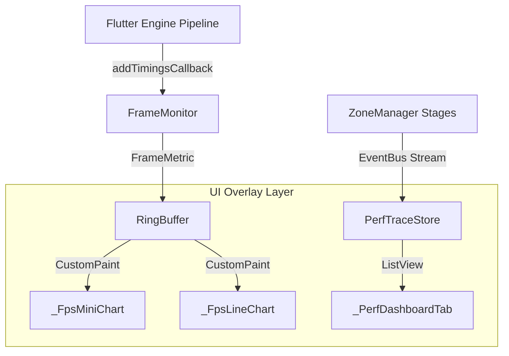

# APM 性能监控面板设计与实现文档

本项目集成了一套轻量级、零原生依赖、专为 Flutter 环境定制的客户端 **APM (Application Performance Monitoring) 性能监测面板**。它能够对帧率 (FPS/Jank)、内存 footprint (Dart RSS)、页面首帧加载时间 (Page Traces) 以及业务 Intent 分段耗时树 (Intent Traces) 进行高精度的采集、平滑滤波与深度可视化诊断。

---

## 1. 核心架构设计

性能监控系统的整体架构采用单向数据流与零耦合的设计原则，共分为：**数据采集层**、**高效缓冲区**、**数据存储层** 与 **可视化表现层**。



### 1.1 数据采集层 (`FrameMonitor`)
* **帧率与时延采集**：利用 `SchedulerBinding.instance.addTimingsCallback` 挂载引擎帧耗时监听，获取包含 UI 线程 Build 和 GPU 线程 Raster 阶段的 `FrameTiming` 数据。
* **低频内存采样**：为降低高频系统调用引起的性能损耗，内存采用 `ProcessInfo.currentRss` 并在后台以 `2-second` 节流定时器进行异步采样。
* **冷启动降噪**：在监控启动时自动屏蔽前 5 帧（Warm-up frames），防范热重载或 App 冷启动时的偶发性卡顿对性能平均基准造成污染。

### 1.2 高效缓冲区 (`RingBuffer<T>`)
* 自研固定容量的环形队列，支持指定 Chronological 顺时下标索引操作 `operator []`。
* **零 GC 堆分配**：通过物理数组循环覆盖机制，避免了 CustomPainter 绘图高频扫描时产生临时 list 复制和堆内存分配，实现极速只读迭代。

### 1.3 业务 Trace 存储层 (`PerfTraceStore`)
* 基于 `ZoneManager` 的分段耗时拦截（如 `Start -> API Query -> Parse JSON -> Render`），将完整的业务 Trace 流通过 EventBus 级别广播解耦，由 `PerfTraceStore` 监听录入。
* 存储层设置 200 条滚动上限，提供 ValueNotifier 响应式更新，实现完美的结构化 Trace 耗时树。

---

## 2. 关键算法与技术突破

### 2.1 物理 Vsync 自适应 Budget Jank 检测算法
传统的卡顿（Jank）检测通常使用固定的 16.6ms（60Hz）作为判定界限。但在现代高刷设备（如 120Hz/ProMotion 屏幕、LTPO 自适应高刷屏）下，这会导致 120Hz 掉帧（8.3ms~16.6ms 之间）无法被捕捉。
* **算法实现**：通过获取相邻帧 `FramePhase.vsyncStart` 的物理时戳差值：
  $$\text{Vsync Budget} = \text{vsyncStart}_{N} - \text{vsyncStart}_{N-1}$$
* 在自适应高刷设备下，自动实时缩放预算基准（8.3ms / 11.1ms / 16.6ms），保证卡顿捕获 100% 精确。

### 2.2 物理脉冲时间轴 FPS 滤波算法（解决 FPS 异常冲高 bug）
* **陷阱问题**：由于 Flutter 引擎是异步批量传递 Timing 回调的（Batch Timings），若采用 `DateTime.now()` 作为每帧时刻，在同一个 UI 刷新微任务周期中，多帧会被盖上相同的时间戳。在 FPS 计算分母时会除以极其微小的 `spanUs` 导致计算出数千 FPS 的算术错误。
* **改进实现**：采用 `timing.timestampInMicroseconds(FramePhase.vsyncStart)` 作为帧的唯一物理时间戳。
* 计算 FPS 时，以最后一帧与滑动窗口内最老帧的 `vsyncStartUs` 差值作分母：
  $$\text{FPS} = \frac{\text{Frame Count} - 1}{\text{Last Vsync Us} - \text{Oldest Vsync Us}} \times 1,000,000$$
* 保证分母最小不低于屏幕物理刷新间隔，辅以一阶低通滤波算法（EMA, $\alpha=0.3$）平滑抖动，完美消除突变。

### 2.3 智能帧激励实时刷新（Frame Warmup）
* 在静止状态下，由于没有界面重绘，Flutter 引擎会暂停触发 `addTimingsCallback` 回调，这会导致面板中的曲线图在闲置时静止不动。
* **激励机制**：当 `Perf Dashboard` Tab 可见时，开启 500ms 周期定时器调用 `setState(() {})`。
* **CustomPainter 重绘规避机制**：因为老 delegate 与新 delegate 内部共享同一个 `RingBuffer` 引用，常规的 `shouldRepaint` 长度/值对比会由于物理指针相同而失效导致缓存。我们将其 `shouldRepaint` 设为恒常返回 `true`，结合定时 `setState`，保证了闲置状态下折线图也具有“平滑向左推移”的滚动呼吸感。
* 当关闭面板时自动注销，恢复 0 常态开销。

---

## 3. 编译期 Tree-shaking 裁剪

为了保证生产环境（Release Mode）包体积的绝对纯净以及“零运行开销”，我们在浮窗初始化与打开的底层入口做了编译期常量拦截：

```dart
static Future<void> init(BuildContext context) async {
  if (kReleaseMode) return; // 编译期常量 guard
  ...
}

static Future<void> show(BuildContext context, {bool startExpanded = false}) async {
  if (kReleaseMode) return; // 编译期常量 guard
  ...
}
```

* **实现原理**：由于 `kReleaseMode` 是编译期常量，Dart AOT 编译器在对 Release 包进行摇树优化（Tree-shaking）时，会判定 `LogOverlayWidget` 及其所有的自绘 Painter、`RingBuffer`、`FrameMonitor` 核心算法等全部为 **不可达代码（Dead Code）**。
* 从而将 APM UI 及绘制逻辑 100% 干净地从生产包中剥离，做到生产包的“零体积污染”与“零后台开销”。

---

## 4. 单元测试与静态分析

项目建立了完善的自动化单元测试集，保障了底层算法的可靠性：
1. **`ring_buffer_test.dart`**：验证环形队列物理越界防护、Chronological Order 读写及覆盖逻辑。
2. **`frame_monitor_test.dart`**：利用 `Mocktail` 模拟 FrameTimings 脉冲，覆盖冷启动降噪、自适应高刷 Budget 对齐、物理时钟 FPS 计算及 `ZoneManager` 的 Trace 自动流转。

通过以下命令运行并确保测试绿灯：
```bash
flutter test test/core/ring_buffer_test.dart test/core/frame_monitor_test.dart
```

静态分析保持全绿，无任何 Warning 或 Error：
```bash
flutter analyze --no-fatal-infos
```
