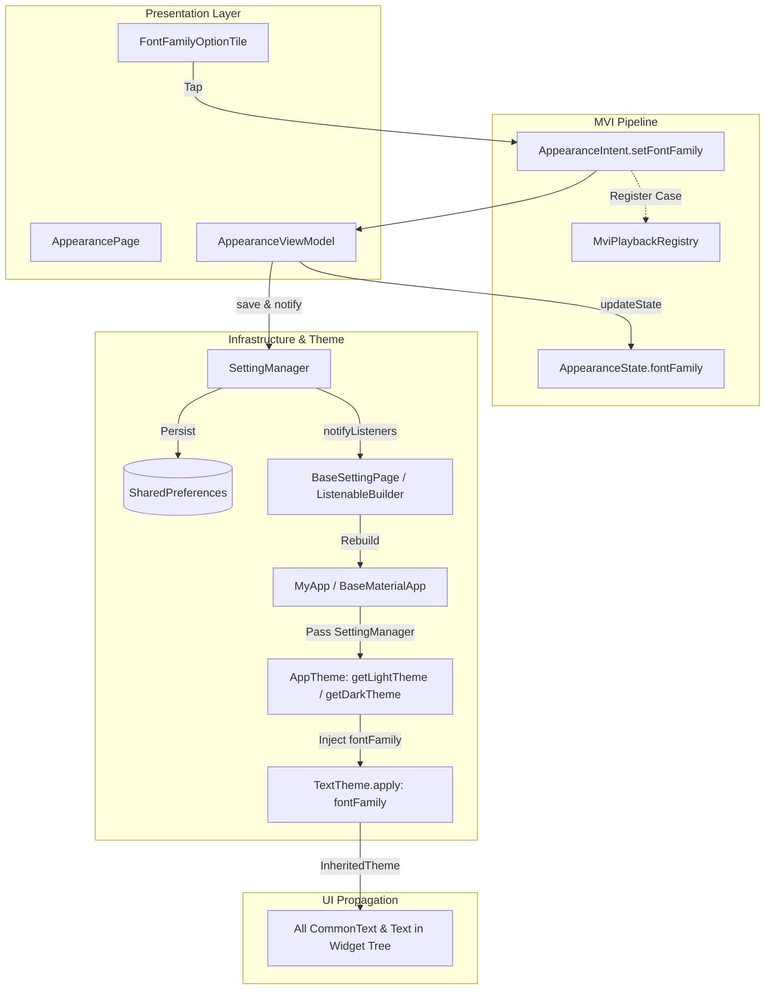

# 外观设置 - 字体族动态切换 (Font Family Dynamic Switching) 规格说明与架构设计

**Status**: `Implemented & Verified (100% Green Unit & Widget Tests)`

---

## 1. 背景与设计目标

在跨平台 Flutter 应用中，字体排版（Typography）直接决定了界面的视觉质感、可读性以及个性化体验。为了提供更丰富的外观定制能力，我们在 **Settings -> Appearance (外观设置)** 中新增了 **字体族 (Font Family)** 动态切换功能。

### 核心设计目标：
1. **全站实时生效 (Instant Hot Switching)**：用户切换字体族后，无需重启应用或重新导航，整站所有文本组件（`CommonText`、`Text`）立即无缝应用新字体。
2. **跨平台原生零开销 (Zero Network & Asset Overhead)**：采用跨平台标准通用字体族体系（Generic Font Families），在 iOS/macOS、Android、Windows、Linux、Web 上直接映射系统预装高品质字体，无需打包体积庞大的外部字体文件或发起网络下载。
3. **MVI 与持久化规范 (Clean Architecture & Persistence)**：完全遵照项目的 MVI 架构、`SettingManager` 本地持久化与 MVI Playback 录制回放机制。
4. **视觉所见即所得 (Live Visual Preview)**：每个字体选项前展示采用该字体实际排版渲染的 `Aa` 样式徽标，辅助用户直观感知字体风格。
5. **严禁硬编码与多语言适配 (Zero Hardcoded Strings & Zero Raw Colors)**：所有文案收口于 `I18nKeys`，颜色完全使用主题 Token。

---

## 2. 跨平台标准字体族矩阵

| 枚举项 (`AppFontFamily`) | 内部标识值 (`fontFamilyName`) | 平台映射策略与视觉风格 | 典型适用场景 |
| :--- | :--- | :--- | :--- |
| **`system`** (系统默认) | `null` | iOS/macOS: `SF Pro` / `PingFang SC` Android: `Roboto` / `Noto Sans SC` Windows: `Segoe UI` / `Microsoft YaHei` | 原生一致性，默认推荐 |
| **`sansSerif`** (无衬线体) | `'sans-serif'` | 现代极简、结构清晰的几何无衬线字体 | 现代 UI、数字看板、快速信息浏览 |
| **`serif`** (衬线体) | `'serif'` | 典雅经典、笔画末端带有装饰衬线的排版字体 | 长文阅读、简历正文、文档展示 |
| **`monospace`** (等宽代码体) | `'monospace'` | 字符宽度严格一致的代码终端等宽字体 | 代码片段、日志查看、调试信息展示 |
| **`cursive`** (手写艺术体) | `'cursive'` | 带有连笔与个性化书写质感的手写艺术字体 | 个性化签名、致谢卡片、艺术标题 |

---

## 3. 架构设计与动态生效数据流

### 关键数据流步骤解析：
1. **用户交互触发**：在 `AppearancePage` 中点击某个 `FontFamilyOptionTile`，向 `AppearanceViewModel` 发送 `AppearanceIntent.setFontFamily(family)`；
2. **ViewModel 响应与转发**：
   - 触发 `updateState(state.copyWith(fontFamily: family))`，更新当前页面选中态；
   - 调用 `settingManager.setFontFamily(family)` 执行业务配置修改；
3. **SettingManager 状态广播与落盘**：
   - 更新内部 `_fontFamily` 字段；
   - 异步通过 `SpUtil.put(AppConstants.fontFamilyKey, family.name)` 持久化到本地存储；
   - 调用 `notifyListeners()` 向外广播配置变更；
4. **根组件实时热重构**：
   - `MyApp` 外层包装的 `BaseSettingPage`（内部为 `ListenableBuilder` 监听 `settingManager`）感知变更触发局部重建；
   - 重建时 `AppTheme.getLightTheme(settingManager)` 与 `getDarkTheme(settingManager)` 重新生成 `ThemeData`；
   - `ThemeData` 的 `fontFamily: settingManager.fontFamily.fontFamilyName` 与 `baseTextTheme.apply(fontFamily: ...)` 立即将全局字体族更新；
   - 整个组件树自顶向下接收到新的 `ThemeData`，所有界面文本秒级生效。

---

## 4. 核心代码变更清单

### 4.1 基础设施与主题层 (`lib/shared/`)
- **[app_constants.dart](file:///C:/Users/liste/Downloads/github/ListenPortfolioFlutter/lib/shared/constants/app_constants.dart)**：
  - 新增持久化 Key：`static const String fontFamilyKey = 'font_family';`
- **[setting_provider.dart](file:///C:/Users/liste/Downloads/github/ListenPortfolioFlutter/lib/shared/theme/setting_provider.dart)**：
  - 定义 `AppFontFamily` 枚举（包含 `system`, `sansSerif`, `serif`, `monospace`, `cursive`）及 `fontFamilyName`、`fromName` 工具方法；
  - `SettingManager` 中增加 `AppFontFamily get fontFamily` 属性；
  - `loadSettings()` 启动时从 `SpUtil` 读取字体设置；
  - `setFontFamily(AppFontFamily family)` 实现持久化与通知；
  - `resetSettings()` 恢复默认设置时自动重置为 `AppFontFamily.system`。
- **[app_theme.dart](file:///C:/Users/liste/Downloads/github/ListenPortfolioFlutter/lib/shared/theme/app_theme.dart)**：
  - `getLightTheme` 与 `getDarkTheme` 中提取 `final fontFamily = themeManager.fontFamily.fontFamilyName;`；
  - 将 `fontFamily` 注入 `ThemeData(fontFamily: fontFamily, ...)` 及 `baseTextTheme.apply(..., fontFamily: fontFamily)`。

### 4.2 多语言国际化 (`lib/shared/i18n/`)
- **[translations_key.dart](file:///C:/Users/liste/Downloads/github/ListenPortfolioFlutter/lib/shared/i18n/translations_key.dart)**：
  - 新增 `fontFamily`, `fontFamilySystem`, `fontFamilySansSerif`, `fontFamilySerif`, `fontFamilyMonospace`, `fontFamilyCursive` 常量定义。
- **[zh.dart](file:///C:/Users/liste/Downloads/github/ListenPortfolioFlutter/lib/shared/i18n/languages/zh.dart)** / **[ja.dart](file:///C:/Users/liste/Downloads/github/ListenPortfolioFlutter/lib/shared/i18n/languages/ja.dart)**：
  - 配置完整的多语言对照（中文、日文、英文）。

### 4.3 外观设置页面 MVI 闭环 (`lib/features/settings/presentation/pages/appearance/`)
- **[appearance_state.dart](file:///C:/Users/liste/Downloads/github/ListenPortfolioFlutter/lib/features/settings/presentation/pages/appearance/appearance_state.dart)**：
  - 状态数据模型中增加 `required AppFontFamily fontFamily` 字段。
- **[appearance_intent.dart](file:///C:/Users/liste/Downloads/github/ListenPortfolioFlutter/lib/features/settings/presentation/pages/appearance/appearance_intent.dart)**：
  - 增加意图定义：`const factory AppearanceIntent.setFontFamily(AppFontFamily fontFamily) = _SetFontFamily;`；
  - 注册 `MviPlaybackRegistry` 反序列化器以支持意图录制与回放。
- **[appearance_view_model.dart](file:///C:/Users/liste/Downloads/github/ListenPortfolioFlutter/lib/features/settings/presentation/pages/appearance/appearance_view_model.dart)**：
  - `build()` 初始化状态时读取 `settingManager.fontFamily`；
  - 实现 `_onSetFontFamily` 处理器，同步调用 `settingManager.setFontFamily` 并刷新 State。
- **[font_family_option_tile.dart](file:///C:/Users/liste/Downloads/github/ListenPortfolioFlutter/lib/features/settings/presentation/pages/appearance/widgets/font_family_option_tile.dart)**：
  - 单独抽取字体族选项磁贴组件；
  - 内置左侧 `Aa` 实时字体徽标（使用当前 Tile 对应的 `fontFamily` 渲染）；
  - 采用 `CommonSettingsCard` 与 `CommonClickable`，纯 Token 取色，带有高亮勾选反馈。
- **[appearance_page.dart](file:///C:/Users/liste/Downloads/github/ListenPortfolioFlutter/lib/features/settings/presentation/pages/appearance/appearance_page.dart)**：
  - 组装 “FONT FAMILY” 区域，使用 `for (final family in AppFontFamily.values)` 动态循环渲染。

---

## 5. 质量保证与自动化测试

本功能已通过全套自动化测试验证，确保功能稳定性与无回归：

1. **国际化完整性测试** (`test/core/i18n_test.dart`)：
   - 验证新增的所有 6 个字体族 Key 均在各语言字典中 100% 存在且非空。
2. **ViewModel 单元测试** (`test/features/settings/appearance/appearance_view_model_test.dart`)：
   - 验证初始状态包含 `AppFontFamily.system`；
   - 验证发送 `AppearanceIntent.setFontFamily` 意图后 State 与 `settingManager` 同步更新；
   - 验证多项外观设置（主题色、字号、字体族、动态取色）混合切换的一致性。
3. **Widget 界面测试** (`test/features/settings/presentation/pages/appearance/appearance_page_test.dart`)：
   - 验证 5 种字体选项磁贴完整渲染；
   - 模拟用户点击等宽体 (`monospace`) 与衬线体 (`serif`)，验证勾选状态与 `settingManager` 状态切换。
4. **主题与扩展测试** (`test/shared/extensions/shared_extensions_and_theme_test.dart`)：
   - 验证 `AppFontFamily.fromName` 容错解析（包括 null/空字符串/非法字符串自动回退 system）；
   - 验证 `settingManager.resetSettings()` 自动重置字体族；
   - 验证 `AppTheme.getLightTheme` / `getDarkTheme` 与 `BuildContextX` 的主题注入。
5. **架构边界静态分析** (`dart tools/dependency_rules.dart`)：
   - 检查全项目分层依赖规则，0 架构违规。
6. **全项目回归测试套件** (`flutter test`)：
   - **529 个测试用例全部绿灯通过 (100% Pass)**。
