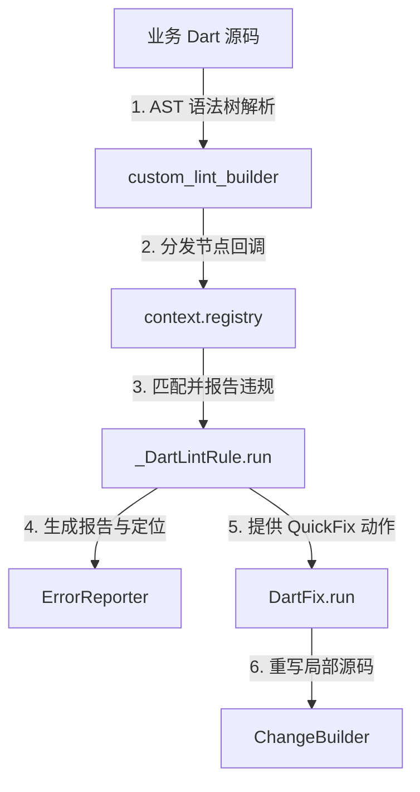

# 自定义静态分析规则 (Custom Lint Rules) 设计与实现文档

为了规范本项目的架构边界、推行公用 UI 组件规范（Common Widgets）、并避免低级错误（如硬编码颜色与字符串、在 ViewModel 中滥用 BuildContext 等），我们在项目中基于 `custom_lint` 构建了专属的静态规则集。

本文档详细介绍了这些自定义规则的设计初衷、实现原理以及如何通过命令行进行自动修复 (`--fix`)。

---

## 1. 自定义规则清单 (Rules List)

所有自定义规则都在工具文件 [dependency_boundary_lint.dart](../tools/lint_rules/lib/src/dependency_boundary_lint.dart) 中实现，并通过 `PluginBase` 对外暴露。

| 规则名称 (Code Name) | 违规场景说明 | 推荐解决方案 / 自动修复行为 | 自动修复支持 |
|---|---|---|:---:|
| `dependency_boundary_violation` | 跨特征模块 (features) 间非法循环导入；核心层核心组件 (core) 向上依赖特征层或共享层 (shared)。 | 重新梳理依赖拓扑结构，降低耦合度。 | ❌ (**占位规则，检测逻辑尚未实现**) |
| `implementation_import` | UI 或 Domain 层直接导入了 Data 层的私有实现类 (`_impl.dart` 或 `impl/` 目录)。 | 改为导入抽象接口类。 | ❌ |
| `cross_feature_relative_import` | 跨 Feature 目录使用了相对路径导入 (如 `../../other_feature/xxx.dart`)。 | 必须使用以 `package:` 路径开头的全局导入。 | ❌ |
| `view_model_context_isolation` | 在 ViewModel 中引用或保存 `BuildContext`。 | ViewModel 中不可访问 UI 上下文，应使用 `emitEffect` 代替。 | ❌ |
| `no_direct_state_assignment` | 在 ViewModel 里对状态属性进行直接赋值 (如 `state = ...`)。 | 使用统一封装的 `updateState(...)` 触发热更新。 | ❌ |
| `no_hardcoded_strings` | 在 `Text` 或 `CommonText` 控件中硬编码显示中英文字符串。 | 必须使用本地化翻译 `I18nKeys.yourKey.tr`。 | ❌ |
| `no_raw_color` | 在非组件库中直接实例化原生 `Color(...)` 或读取 `Colors.xxx` 静态色彩定义。 | 使用 `context.theme` 中的主题色，保障暗黑模式适配。 | ❌ |
| `use_common_image` | 直接实例化 Flutter SDK 官方的 `Image` 组件。 | 自动替换为带缓存和 Premium 体验的 `CommonImage`。 |  (Auto-Fix) |
| `use_common_clickable` | 直接实例化 Flutter SDK 的 `InkWell` 或 `GestureDetector`。 | 自动替换为 `CommonClickable`。对于 `GestureDetector` 会自动补充 `ripple: false` 参数以保持纯粹的无水波纹点击事件。 |  (Auto-Fix) |
| `use_common_text` | 直接使用原生 `Text` 组件。 | 自动替换为 `CommonText`。 |  (Auto-Fix) |
| `use_common_button` | 直接使用 `ElevatedButton`, `TextButton`, `OutlinedButton`, `FilledButton`, `CupertinoButton` 等原生按钮。 | 自动替换为规范按钮 `CommonButton`。 |  (Auto-Fix) |
| `use_common_icon_button` | 直接使用 `IconButton`。 | 自动替换为 `CommonIconButton`。 |  (Auto-Fix) |
| `use_common_switch` | 直接使用 `Switch` 或 `CupertinoSwitch` 组件。 | 自动替换为 `CommonSwitch`。 |  (Auto-Fix) |
| `use_common_text_field` | 直接使用 `TextField` 或 `TextFormField` 组件。 | 自动替换为 `CommonTextField`。 |  (Auto-Fix) |
| `use_common_refresh_list` | 直接使用 `RefreshIndicator` 或 `ListView` 实现下拉刷新功能。 | 自动替换为 `CommonRefreshList`。 |  (Auto-Fix) |
| `use_common_dialog` | 在业务层直接调用 Flutter 原生的全局方法 `showDialog` 或 `showGeneralDialog`。 | 统一使用 `CommonDialog` 的辅助静态方法进行弹窗触发。 | ❌ |
| `no_direct_app_nav_usage` | 在 ViewModel 以外的地方直接调用 `AppNav` 路由跳转方法。 | 统一通过 Intent/Effect 机制将路由跳转代理到 ViewModel 层处理。 | ❌ |

---

## 2. 核心架构与实现原理

自定义规则工具基于 `custom_lint_builder` 实现，底层对 Dart 语法树 (AST - Abstract Syntax Tree) 进行模式匹配和节点分析。

### 2.1 依赖关系架构示意



### 2.2 静态规则匹配实现 (以 `_UseCommonImageRule` 为例)

我们通过 `addInstanceCreationExpression` 对实例创建语句进行匹配，并检查类的包名路径是否来自外部以排除组件库本身的递归触发：
```dart
class _UseCommonImageRule extends DartLintRule {
  static const LintCode _code = LintCode(
    name: 'use_common_image',
    problemMessage: 'Avoid using Image widget directly.',
    correctionMessage: 'Replace with CommonImage from package:listen_uikit.',
  );

  const _UseCommonImageRule() : super(code: _code);

  @override
  void run(CustomLintResolver resolver, ErrorReporter reporter, CustomLintContext context) {
    // 监听所有实例化事件
    context.registry.addInstanceCreationExpression((InstanceCreationExpression node) {
      final typeElement = node.staticType?.element;
      if (typeElement == null) return;

      final typeName = typeElement.name;
      final libraryUri = typeElement.library?.uri.toString() ?? '';
      
      // 必须是 package:flutter 中的官方原生小部件
      final isFlutterWidget = libraryUri.startsWith('package:flutter/');
      if (!isFlutterWidget) return;

      // 排除 UIKit 开发本身以及工具目录
      final filePath = resolver.source.fullName;
      if (filePath.contains('ListenUiKit') || filePath.contains('tools/')) return;

      // 如果类型为 Image，则上报 lint 警告
      if (typeName == 'Image') {
        reporter.atNode(node, _code);
      }
    });
  }
}
```

---

## 3. 自动修复 (Quick-Fix) 的机制设计

当规则返回继承自 `DartFix` 的类时，编辑器（如 VSCode/Android Studio）会在违规代码行提供 “Quick Fix” 提示，并且可以通过命令行一键批处理。

### 3.1 自动替换代码实现 (以 `_UseCommonImageFix` 为例)
```dart
class _UseCommonImageFix extends DartFix {
  @override
  void run(
    CustomLintResolver resolver,
    ChangeReporter reporter,
    CustomLintContext context,
    AnalysisError analysisError,
    List<AnalysisError> others,
  ) {
    context.registry.addInstanceCreationExpression((InstanceCreationExpression node) {
      // 检查当前节点是否是发生报错的节点
      if (!analysisError.sourceRange.intersects(node.sourceRange)) return;

      final typeElement = node.staticType?.element;
      if (typeElement == null) return;
      final typeName = typeElement.name;
      if (typeName != 'Image') return;

      final changeBuilder = reporter.createChangeBuilder(
        message: 'Replace with CommonImage',
        priority: 80,
      );

      // 编辑文件内容
      changeBuilder.addDartFileEdit((builder) {
        // 自动往文件头部插入 package:listen_uikit 的 import，且会自动防重合
        builder.importLibraryElement(Uri.parse('package:listen_uikit/uikit.dart'));

        final constructorName = node.constructorName;
        final name = constructorName.name?.name;

        // 根据不同的命名构造函数自动重写为 CommonImage 对应的方法
        if (name == 'asset') {
          builder.addSimpleReplacement(
            SourceRange(constructorName.offset, constructorName.length),
            'CommonImage.asset',
          );
        } else if (name == 'network') {
          builder.addSimpleReplacement(
            SourceRange(constructorName.offset, constructorName.length),
            'CommonImage.url',
          );
        } else if (name == 'file') {
          builder.addSimpleReplacement(
            SourceRange(constructorName.offset, constructorName.length),
            'CommonImage.file',
          );
        } else {
          builder.addSimpleReplacement(
            SourceRange(constructorName.offset, constructorName.length),
            'CommonImage',
          );
        }
      });
    });
  }
}
```

---

## 4. 命令行一键自动修复指南

在终端中，运行以下命令可以对全工程内所有支持自动修复的 Lint 违规点进行一键替换：

```bash
# 1. 清理缓存，确保读取最新的规则集
dart run custom_lint --clean

# 2. 执行静态规则检查，并批量修复全代码库的违规组件
dart run custom_lint --fix
```

> [!TIP]
> 运行完成后，可以通过 `git diff` 查看自动重构的效果。工具会自动为被修复的文件在头部追加相应的 `import 'package:listen_uikit/uikit.dart';` 引用声明，十分智能。

---

## 5. 关联配置文件

- **自定义分析规则插件源码**：[dependency_boundary_lint.dart](../tools/lint_rules/lib/src/dependency_boundary_lint.dart)
- **分析器开启规则配置**：[analysis_options.yaml](../analysis_options.yaml)
- **分析插件依赖声明**：[pubspec.yaml](../tools/lint_rules/pubspec.yaml)
