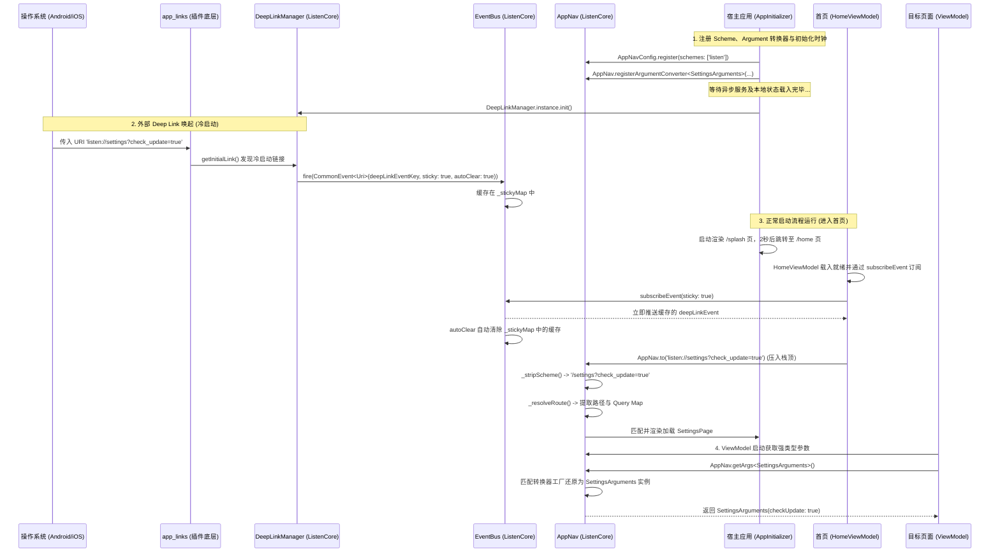

# 强类型路由与 Deep Link 架构设计及决策文档

## 1. 业务背景
在 ListenPortfolio 中，应用需要支持通过统一的外部 Deep Link Scheme（如 `listenportfolio://`）直接唤起并下钻到应用内的指定页面（如 `SettingsPage`，并按需执行特定行为，如开启新版本检测）。为了保障类型安全、避免硬编码的字符串参数转换异常，并实现底座 `ListenCore` 与宿主 `ListenPortfolioFlutter` 的解耦，我们设计并落地了此强类型路由与 Deep Link 解析体系。

---

## 2. 核心架构设计

### 2.1 依赖倒置与解耦 (Business-Agnostic Core)
为了保持底座 `ListenCore` 纯粹的业务中立性，我们没有在底座写死任何特定业务的路由参数类或 URI schemes，而是采用了**动态 Scheme 注册**与**转换器委托注册（Converter Delegate）**机制。

* **Scheme 动态注册**：宿主应用在初始化 `CoreConfig` 时，通过 `schemes` 列表指定支持的自定义协议（如 `listenportfolio`、`myapp`）。
* **转换器委托注册**：宿主应用将具体的 `SignUpArguments`、`SettingsArguments`、`CrashLogListArguments` 实体类定义在宿主侧，并向底座注册反序列化工厂函数 `AppNav.registerArgumentConverter`。

### 2.2 流程时序图
当外部唤起链接拉起应用时，完整路径如下：



---

## 3. 技术方案设计与实现

### 3.1 协议头裁剪与统一解析 (`AppNav`)
底座 `_stripScheme` 方法不再硬编码任何 Scheme，而是采用循环匹配：
```dart
  static String _stripScheme(String target) {
    var path = target;
    for (final scheme in AppNavConfig.schemes) {
      final prefix = '$scheme://';
      if (path.startsWith(prefix)) {
        path = path.substring(prefix.length);
        if (!path.startsWith('/')) {
          path = '/$path';
        }
        break;
      }
    }
    return path;
  }
```

### 3.2 转换器注册与类型安全获取
宿主应用自定义强类型类，并在初始化时通过工厂方法反序列化：
```dart
class SettingsArguments {
  final bool checkUpdate;
  const SettingsArguments({this.checkUpdate = false});

  factory SettingsArguments.fromMap(Map<String, dynamic> map) {
    final val = map['check_update'] ?? map['checkUpdate'];
    return SettingsArguments(checkUpdate: val == 'true' || val == true);
  }
}
```

---

## 4. 架构决策记录：原生 Deep Link 与 `app_links` 的对比与权衡

在开发过程中，我们对**直接使用原生默认 Deep Link** 和 **集成第三方 `app_links` 进行流分发**进行了深度权衡：

### 4.1 权衡对比
1. **原生默认 Deep Link**：
   * **运行原理**：系统收到 Activity 意图后，直接通过 Flutter 引擎通知 `MaterialApp` 对该 URI 执行 `Navigator.push`。
   * **缺陷（冷启动依赖崩溃漏洞）**：冷启动时，异步初始化流程（如 `SpUtil.init()`）尚未执行完毕，原生层便已经强行 Push 并构建页面。ViewModel 访问尚未就绪的依赖会导致运行时空指针崩溃。
2. **`app_links` 插件**：
   * **运行原理**：禁用 Flutter 原生的自动路由。链接被捕获为 Dart 层 Stream，由我们在初始化彻底完成、第一帧渲染就绪后，手动调起 `AppNav.to` 执行跳转。
   * **优势**：完美控制跳转时钟，规避冷启动依赖加载不同步的问题，并可在跳转前在 Dart 层轻松进行登录态鉴权拦截。

### 4.2 决策演进与最终落地
经过深度评估，为了消除冷启动时异步初始化未就绪导致的安全隐患，我们已于 **2026-07-10** 决定**正式落地 `app_links` 方案**作为生产环境的默认配置。

具体落地细节：
1. **禁用原生路由分发**：在 `AndroidManifest.xml`（Android）与 `Info.plist`（iOS）中配置禁用原生自动拦截。
2. **时序控制（时钟对齐）**：在 `AppInitializer.init()` 方法 of 宿主应用的最后一行开启 `DeepLinkManager.init()`，确保冷启动下依赖 100% 装载完毕后再触发跳转。
3. **底座共通化**：将 `DeepLinkManager` 写入底座 `ListenCore`，通过暴露 `onLinkReceived` 面向切面的 Hook 维持了业务解耦，并且实现了冷热启动逻辑的高度统一。

---

## 5. 路由重用、防冲突与双重弹窗规避设计 (Route Re-entry & Issue Prevention)

在深链接频繁或重复跳转时，应用会面临路由堆叠、Riverpod Provider 被重用及 UI 监听器并发冲突等技术挑战。为此，我们落地了以下底层防护逻辑：

### 5.1 相同路由去重与跳转策略 (`replaceIfExists`)
当用户已经处于目标页面（如 `/settings`）且再次触发相同的跳转命令时，`AppNav.to` 支持两种路由再入策略，可通过参数自主选择：
* **直接返回（默认行为）**：如果 target 路由已是当前路由且未指定额外动作，直接返回不执行任何跳转，保障性能最佳（避免动画抖动与重绘）。
* **替换模式（`replaceIfExists = true`）**：在 `adb` 深链接等需要传参并刷新当前页面内容时，调用 `pushReplacement` 重建路由以保证新的 arguments（如 `check_update=true`）被完全加载。

### 5.2 过渡期双重弹窗与 MVI 单订阅绑定（Single UI Binder）
当使用 `pushReplacement` 替换当前路由时，新页面插入和老页面销毁存在约 300ms 的动画过渡重叠。由于新老页面短时间内共存，Riverpod 会直接复用仍被引用的 ViewModel 实例，老页面若依然监听此 ViewModel 的 `effectStream`，会导致同一个异步副作用（如 `checkUpdates` 成功后派发的 `ConfirmEffect`）同时在两个页面触发，从而弹出两次确认框。

针对这一问题，我们通过双重同步拦截确保单一订阅者模式（Single UI Binder）：
1. **ViewModel 端同步解绑（主要保护）**：在 `BaseViewModel.onBindEffect` 中增加排他性解绑：一旦有新视图（新页面）执行绑定，立即同步取消（`cancel`）前一个 UI 的 `StreamSubscription` 句柄，杜绝 ViewModel 复用期间的老页面残留监听。
2. **View 级防御性 Pop 拦截（辅助保护）**：在 `BaseLifeCyclePage` 层的路由观察代理中注册 `onPop`。当 `pop` 或 `pushReplacement` 动作发出时，老页面通过 Navigator 收到 `didPop` 回调瞬间同步注销对 ViewModel `effectStream` 的所有监听，不依赖动画结束后才执行的 `dispose()`。

通过这套机制，框架成功保证了即使在多路由瞬时重叠、Provider 频繁重用的高压场景下，MVI 副作用也始终遵循单向、单发与高安全的通道分发原则。

---

## 6. 系统返回手势与 PopScope 统一管理设计 (Unified Back Gesture & PopScope Management)

随着 Android 13/14+ 预测性返回手势（Predictive Back）的引入，以及对页面返回生命周期管理的整洁性要求，我们将系统返回手势的拦截与分发逻辑从 UI 布局骨架层（`BaseScaffoldPage`）彻底移出，在生命周期底座层（`BaseLifeCyclePage`）进行了统一封装。

### 6.1 核心设计原则

1. **布局与手势控制解耦**：
   * `BaseScaffoldPage` 不再包含任何 `PopScope` 或返回拦截的逻辑，保持其作为布局脚手架的纯粹职责。
   * `BaseLifeCyclePage` 作为包裹每个独立页面的生命周期组件，统一接管 `PopScope` 返回手势监听。
2. **加载态手势拦截与异步请求注销优先级**：
   * 当页面存在内部加载态（`_isInternalLoading.value == true`）时，系统返回键会被直接拦截（`canPop = false`）。
   * 拦截发生后，框架通过精简、零冗余的逻辑优先执行后台异步请求的取消（`_viewModel?.cancelRequests("onBackInvoked")`），并发送副作用重置页面加载状态，实现“首击取消加载并中断请求”。
3. **多标签页回退与双击退出应用（`HomePage`）**：
   * 针对应用的根页面（`HomePage`），系统手势始终被拦截（`canPop = false`）。
   * 当用户从二级标签页返回时，侧滑手势自动导向第一页（`Overview` 标签）。
   * 当处于 `Overview` 页面时，侧滑手势将触发 2 秒内的双击检测：第一击显示国际化 Toast 提示（如“再按一次退出应用”），2 秒内再次点击则调用 `SystemNavigator.pop()` 退出，实现流畅的原生回退体验，避免误触退出。

### 6.2 零重复代码的 PopScope 分发实现 (`onPopInvokedWithResult`)

在 `BaseLifeCyclePage` 中，我们以一种优雅、免维护的形式组合了出栈生命周期和拦截逻辑，规避了大量样板代码的复制：

```dart
          onPopInvokedWithResult: (didPop, resultVal) {
            // 是否应当拦截并触发自定义返回事件（仅当非出栈、非加载中、且定义了自定义拦截时）
            final shouldInterceptCustomBack = !didPop && !_isInternalLoading.value && widget.onInterceptBack != null;
            if (shouldInterceptCustomBack) {
              // 触发自定义拦截回调
              widget.onInterceptBack!();
            } else {
              // 统一注销挂起中的请求以释放网络资源
              _viewModel?.cancelRequests("onBackInvoked");
              if (!didPop) {
                // 如果是加载中触发返回拦截（!didPop 且 _isInternalLoading 为 true），或者回退兜底，则重置并取消加载框
                _viewModel?.emitEffect(LoadingEffect(false));
              }
            }
          },
```
通过该设计，整个架构保障了在返回手势交互下网络请求的即时回收、UI 加载态的智能闭环，以及根级页面返回栈的最佳实践。

