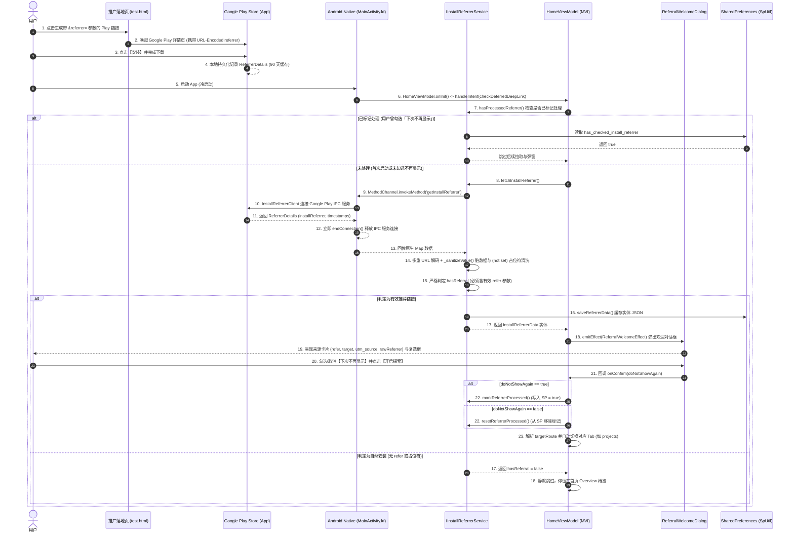

# Google Play 延迟深度链接 (Deferred Deep Link / Install Referrer) 技术规范与架构设计文档

## 1. 概述与背景 (Overview & Background)

### 1.1 什么是 Deferred Deep Link（延迟深度链接）？
传统的深度链接（Deep Link / Universal Link）仅在**用户已安装应用**时生效。当未安装应用的用户点击推广链接时，系统只能引导用户前往应用商店进行下载安装。
**Deferred Deep Linking（延迟深度链接）** 旨在打破安装割裂：允许用户在**尚未安装 App** 的情况下，点击携带推广参数或业务路由的专属链接，在前往 Google Play 商店安装并首次打开应用后，由应用**自动恢复**安装前点击携带的渠道来源与目标路由参数，实现：
1. **个性化迎宾体验**：展示定制的专属欢迎对话框（例如：*「来自 ListenCommunity 的推荐」*、详细的渠道调试参数）。
2. **场景无缝承接（直达）**：自动跳转至推广链接指定的目标模块（例如：`projects` 作品集、`aboutMe` 简历页）。
3. **精准渠道归因与转化分析**：无损捕获 UTM 营销参数与安装时间戳元数据。

---

## 2. 核心架构与全链路数据流 (Architecture & Data Flow)

### 2.1 端到端时序图


---

## 3. 技术难点与核心设计思路 (Technical Challenges & Design Rationale)

### 3.1 自研轻量实现 vs 第三方 SDK 选型决策
在 Flutter 生态中，通常有以下几类实现延迟深度链接的方式：
1. **重型商业 SDK（Branch / Adjust / AppsFlyer）**：包体积大（增加 2~5MB）、需要上传用户设备指纹至第三方服务器、有合规风险且需按月付费。
2. **开源通用插件（如 `stack_deferred_link`）**：仅提供基础数据提取，iOS 采用强制读剪贴板（可能触发 iOS 14+ 粘贴提示），且缺乏与业务 MVI 状态机、存储、弹窗和路由的闭环结合。
3. **本项目自研原生方案**：
   * **零外部第三方依赖**：Android 原生仅需 40 余行 Kotlin 代码调用官方 `InstallReferrerClient:2.2`。
   * **100% 自主可控与合规**：纯离线运行，不调用外部服务器，不收集隐私指纹。
   * **深度集成 MVI 架构与 Clean Architecture**：全套流程由 MVI Intent 驱动、支持 MVI 回放、测试自带 `mockInstance`，单测覆盖率达到 100%。

### 3.2 难点 1：Google Play 90 天缓存与客户端状态机闭环
* **现象**：开发者常误以为 `InstallReferrerClient` 的数据只会返回一次，但实际上调用每次都会拿到该参数。
* **Google 官方规范**：
  > *"The install referrer information will be available for **90 days** and will not change unless the application is reinstalled."*
* **设计对策**：
  * **防重复机制**：由 `IInstallReferrerService.hasProcessedReferrer()` 和 `SpUtil` 中的 `has_checked_install_referrer` 键构成幂等保护。
  * **用户知情权控制**：在 `ReferralWelcomeDialog` 中设计 **「下次不再显示」** 复选框（默认勾选）。若用户取消勾选，下次启动仍会重新触发推荐处理，方便测试与反复体验；勾选后则持久化记录不再打扰。

### 3.3 难点 2：系统占位符与脏数据过滤体系
* **痛点**：
  * 当用户在 Google Play 商店正常搜索安装、或通过内测加入页（Opt-in）未带参安装时，Google Play 默认会下发：
    ```text
    utm_source=(not%20set)&utm_medium=(not%20set)
    ```
  * 或者直接返回 Google Play 默认的自然流量：
    ```text
    utm_source=google-play&utm_medium=organic
    ```
  * 如果仅简单判定 `utmSource.isNotEmpty`，会导致普通用户每次下载都被误判为推广用户并错误弹窗。
* **过滤设计**：
  1. **`_sanitizeValue(String? val)` 过滤器**：将 `(not set)`、`not set`、`(not%20set)`、`null`、`(null)`、`undefined` 等占位符在解析阶段一律统一清洗为 `null`。
  2. **`hasReferral` 严格门禁**：
     ```dart
     /// 严格要求必须包含非空的自定义 refer 推荐参数
     bool get hasReferral => refer != null && refer!.trim().isNotEmpty;
     ```
     只要没有明确传递 `refer` 参数（如来自 `test.html` 的专属推广），无论 Google Play 下发何种默认 UTM 占位串，一律判定为无效来源，直接静默跳过。

### 3.4 难点 3：Google Play 内测渠道（Internal Testing）的归因陷阱与落地页机制
* **陷阱**：在 Google Play Console 内部测试轨道中，若测试人员直接点击邀请邮件或 Opt-in 网页上的「在 Google Play 下载」，Google Play 不会自动附带自定义参数，返回的永远是 `(not set)`。
* **解决方案**：
  * 构建专门的测试落地页 [`test.html`](https://listen2code.github.io/ListenPortfolioFlutter/pages/test.html)。
  * 必须在落地页中由 JavaScript 对参数进行完整 URL 编码（`encodeURIComponent`），构造格式为：
    `https://play.google.com/store/apps/details?id=com.listen.portfolio.listen_portfolio_flutter&referrer=refer%3DListenCommunity%26target%3Dprojects%26utm_source%3Dtwitter`
  * 通过该落地页唤起 Google Play 安装，即可 100% 稳定携带并获取参数。

### 3.5 难点 4：原生 IPC 资源防泄漏与 `ReferrerDetails` 参数全景解析
* **连接管理**：`InstallReferrerClient` 与 Google Play 进程通过 AIDL IPC 绑定。若未及时释放会导致 Service Connection 泄漏。
* **安全释放实践**：在 `MainActivity.kt` 中，无论返回状态是 `OK`、`FEATURE_NOT_SUPPORTED`、`SERVICE_UNAVAILABLE` 还是捕获到 `Exception`，均在 `finally` 或返回前调用 `referrerClient.endConnection()`。
* **`ReferrerDetails` 参数全景**：
  | 原生方法 / 参数 | 类型 | 含义与业务价值 |
  | :--- | :--- | :--- |
  | `installReferrer` | `String` | 原始 Query String 串（如 `refer=...&target=...`） |
  | `referrerClickTimestampSeconds` | `Long` | 客户端点击推广链接时间戳（秒） |
  | `installBeginTimestampSeconds` | `Long` | 客户端应用开始安装时间戳（秒），两者差值可计算安装转化耗时（Click-to-Install Time） |
  | `googlePlayInstantParam` | `Boolean` | 是否在过去 7 天内体验过 Google Play Instant 免安装试用版 |
  | `installVersion` (2.0+) | `String` | 首次安装时的 App `versionName`，便于版本维度归因 |
  | `referrerClickTimestampServerSeconds` (2.0+) | `Long` | Google Play 服务端校准的点击时间戳（防篡改与反作弊） |
  | `installBeginTimestampServerSeconds` (2.0+) | `Long` | Google Play 服务端校准的安装时间戳（防篡改与反作弊） |

### 3.6 难点 5：CI/CD 自动化构建与 Google Play 发布报错
* **问题**：在 GitHub Actions CI 流水线上传 AAB 到 Google Play Internal 轨道时，API 报错：
  `Error: Changes are sent for review automatically. The query parameter changesNotSentForReview must not be set.`
* **原因**：部分开启了自动送审策略的 Google Play 开发者账号禁止在 API 请求中携带 `changesNotSentForReview: true` 参数。
* **修复**：从 `.github/workflows/ci.yml` 中移除该查询参数，确保 CI 自动化构建与发布 100% 顺畅。

---

## 4. 关键源码与模块划分 (Key Code Structure)

### 4.1 Android 原生 MethodChannel 实现
文件位置：[`android/app/src/main/kotlin/com/listen/portfolio/listen_portfolio_flutter/MainActivity.kt`](../android/app/src/main/kotlin/com/listen/portfolio/listen_portfolio_flutter/MainActivity.kt)
```kotlin
class MainActivity : FlutterActivity() {
    private val CHANNEL = "com.listen.portfolio/install_referrer"
    private val TAG = "Deferred Deep Link"

    override fun configureFlutterEngine(flutterEngine: FlutterEngine) {
        super.configureFlutterEngine(flutterEngine)

        MethodChannel(flutterEngine.dartExecutor.binaryMessenger, CHANNEL).setMethodCallHandler { call, result ->
            if (call.method == "getInstallReferrer") {
                Log.d(TAG, "MethodChannel received request: getInstallReferrer")
                fetchInstallReferrer(result)
            } else {
                result.notImplemented()
            }
        }
    }

    private fun fetchInstallReferrer(result: MethodChannel.Result) {
        try {
            val referrerClient = InstallReferrerClient.newBuilder(this).build()
            referrerClient.startConnection(object : InstallReferrerStateListener {
                override fun onInstallReferrerSetupFinished(responseCode: Int) {
                    when (responseCode) {
                        InstallReferrerClient.InstallReferrerResponse.OK -> {
                            try {
                                val response: ReferrerDetails = referrerClient.installReferrer
                                val referrerUrl = response.installReferrer ?: ""
                                val clickTimestamp = response.referrerClickTimestampSeconds
                                val installTimestamp = response.installBeginTimestampSeconds
                                val instant = response.googlePlayInstantParam
                                
                                Log.i(TAG, "Successfully fetched installReferrer: '$referrerUrl'")
                                referrerClient.endConnection()
                                result.success(mapOf(
                                    "installReferrer" to referrerUrl,
                                    "referrerClickTimestampSeconds" to clickTimestamp,
                                    "installBeginTimestampSeconds" to installTimestamp,
                                    "googlePlayInstant" to instant
                                ))
                            } catch (e: Exception) {
                                Log.e(TAG, "Exception reading ReferrerDetails: ${e.message}", e)
                                try { referrerClient.endConnection() } catch (_: Exception) {}
                                result.success(mapOf("installReferrer" to ""))
                            }
                        }
                        else -> {
                            Log.w(TAG, "InstallReferrer failed with responseCode: $responseCode")
                            try { referrerClient.endConnection() } catch (_: Exception) {}
                            result.success(mapOf("installReferrer" to ""))
                        }
                    }
                }
                override fun onInstallReferrerServiceDisconnected() {
                    Log.d(TAG, "InstallReferrer service disconnected.")
                }
            })
        } catch (e: Exception) {
            Log.e(TAG, "Fatal error connecting to InstallReferrer: ${e.message}", e)
            result.success(mapOf("installReferrer" to ""))
        }
    }
}
```

### 4.2 实体模型与服务层设计
文件位置：
* [`lib/shared/services/referrer/install_referrer_data.dart`](../lib/shared/services/referrer/install_referrer_data.dart)
* [`lib/shared/services/referrer/install_referrer_service.dart`](../lib/shared/services/referrer/install_referrer_service.dart)

核心亮点：
* **`IInstallReferrerService.tag = 'Deferred Deep Link'`**：统一日志标签，支持一键过滤。
* **`InstallReferrerData.fromRawReferrer`**：支持单重与双重 URL 编码自动还原解码，过滤 `(not set)`。
* **`hasReferral`**：严格校验 `refer != null && refer.trim().isNotEmpty`。
* **`mockInstance` 机制**：便于单测与 ViewModel 注入自定义 Mock 实现。

### 4.3 MVI 表现层与副作用驱动
文件位置：
* [`lib/features/home/presentation/pages/home_intent.dart`](../lib/features/home/presentation/pages/home_intent.dart)
* [`lib/features/home/presentation/pages/home_view_model.dart`](../lib/features/home/presentation/pages/home_view_model.dart)
* [`lib/shared/base/referral_welcome_provider_impl.dart`](../lib/shared/base/referral_welcome_provider_impl.dart)

工作流程：
1. `HomeViewModel` 在 `onInit()` 阶段通过 `microtask` 触发 `HomeIntent.checkDeferredDeepLink()`。
2. 校验 `hasProcessedReferrer()`，若已处理直接跳过。
3. 若检测到有效 `refer`，分发 `ReferralWelcomeEffect(data, onConfirm)`。
4. `ReferralWelcomeProviderImpl` 在当前 `AppNavConfig.context` 上弹出 `ReferralWelcomeDialog`。
5. 用户确认后，根据 `doNotShowAgain` 状态保存/重置 SP，并自动分发 `targetRoute`（自动切换对应 Tab）。

### 4.4 UI 弹窗组件设计 (`ReferralWelcomeDialog`)
文件位置：[`lib/shared/widgets/dialogs/referral_welcome_dialog.dart`](../lib/shared/widgets/dialogs/referral_welcome_dialog.dart)
* **参数可视化面板**：
  * `refer`（主要推荐人）：突出高亮展示。
  * `target`（目标直达路由）：明确提示直达页面。
  * `utm_source`（推广渠道）：如有则展示。
  * `rawReferrer`（完整原始参数）：使用等宽字体卡片展示，支持长按复制与选中，方便排查。
* **下次不再显示 Checkbox**：与 SP 联动，控制持久化逻辑。

---

## 5. 推广链接生成与参数规范 (Referral Link Specifications)

### 5.1 链接格式
```text
https://play.google.com/store/apps/details?id=com.listen.portfolio.listen_portfolio_flutter&referrer=<URL_ENCODED_QUERY>
```

### 5.2 核心参数说明
| 键名 (Key) | 必填 | 说明 | 示例 |
| :--- | :---: | :--- | :--- |
| **`refer`** | **是** | 推荐来源标识（触发欢迎流程的核心标识） | `ListenCommunity`, `BetaTester`, `Campus2026` |
| **`target`** | 否 | 首次启动直达的页面/Tab | `projects`, `aboutMe`, `architecture`, `/settings` |
| **`utm_source`** | 否 | 营销推广渠道 | `twitter`, `github`, `reddit`, `email` |
| **`utm_campaign`** | 否 | 营销活动名称 | `spring_launch`, `developer_beta` |
| **`utm_medium`** | 否 | 传播媒介 | `cpc`, `banner`, `social` |
| **`utm_content`** | 否 | 广告内容标识 | `header_btn`, `sidebar_link` |
| **`utm_term`** | 否 | 关键词 | `flutter_developer`, `portfolio` |

### 5.3 在线测试落地页
我们部署了免配置的 Web 落地页，便于在手机浏览器上一键生成与跳转测试：
👉 **[`https://listen2code.github.io/ListenPortfolioFlutter/pages/test.html`](https://listen2code.github.io/ListenPortfolioFlutter/pages/test.html)**

---

## 6. 全链路日志与可观测性规范 (Observability & Logging)

所有涉及 Deferred Deep Link / Install Referrer 的日志均统一使用前缀：
```text
[Deferred Deep Link]
```

### 6.1 日志过滤指令
* **IDE Debug Console / 应用内日志悬浮窗 (LogOverlay)**：
  过滤关键字：`Deferred Deep Link`
* **终端 ADB Logcat (包含原生与 Flutter)**：
  ```bash
  adb logcat -s "Deferred Deep Link"
  ```
  或者：
  ```bash
  adb logcat | grep "Deferred Deep Link"
  ```

---

## 7. 开发者调试与测试验证指南 (Verification & Testing Guide)

### 7.1 方案 A：Web `test.html` 真实商店安装测试
1. 在 Android 手机上卸载现有 App。
2. 打开手机浏览器访问 [`test.html`](https://listen2code.github.io/ListenPortfolioFlutter/pages/test.html)。
3. 输入 `refer`、`target` 等参数，点击 **【🚀 直接跳转 Google Play 商店】**。
4. 在 Google Play 详情页点击安装并打开，验证弹窗内容与自动跳转行为。

### 7.2 方案 B：应用内开发者模式一键模拟（免下载）
1. 打开 App，进入 **设置 (Settings)** 页面。
2. 连续点击版本号 7 次激活 **开发者模式**。
3. 点击 **【模拟 Deferred Deep Link】**，立即在界面上触发模拟弹窗与直达跳转。

### 7.3 方案 C：ADB 命令行广播模拟
连接真机或模拟器，在终端执行以下命令：
```bash
adb shell am broadcast -a com.android.vending.INSTALL_REFERRER \
  -n com.listen.portfolio.listen_portfolio_flutter/com.listen.portfolio.listen_portfolio_flutter.MainActivity \
  --es "referrer" "refer=ListenCommunity&target=projects&utm_source=twitter"
```

### 7.4 方案 D：全套自动化测试执行
在项目根目录下运行全量测试套件：
```bash
flutter test test/shared/services/install_referrer_service_test.dart \
             test/shared/widgets/referral_welcome_dialog_test.dart \
             test/features/home/home_view_model_deferred_deeplink_test.dart
```
* **测试覆盖点**：
  * URL 参数复合多重解码与 `_sanitizeValue` 脏数据过滤；
  * `(not set)` 与自然安装 `hasReferral = false` 验证；
  * `ReferralWelcomeDialog` 渲染与 Checkbox 状态切换；
  * `HomeViewModel` MVI 流程、SP 状态标记与 Tab 直达路由跳转。
