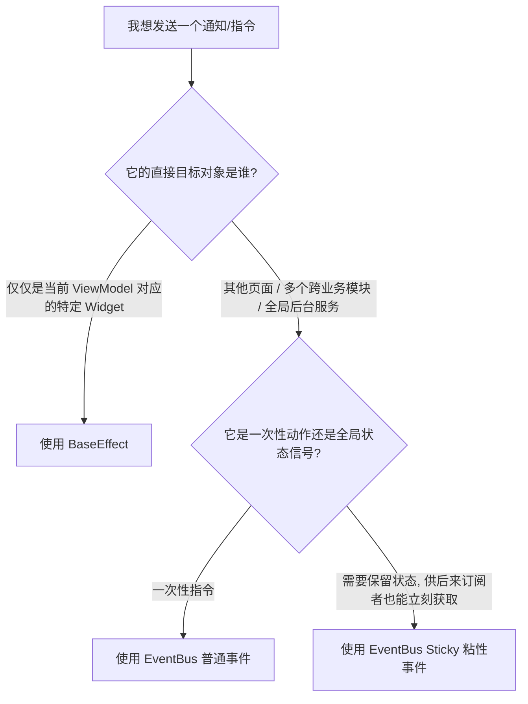

# EventBus 与 BaseEffect 职责评估与设计规范

在 `ListenCore` / `ListenPortfolio` 干净架构体系中，UI 的交互与状态更新主要通过单向数据流进行。然而，对于某些非持久化的“一次性行为”或“解耦通信”，我们需要借助特殊的管道来实现。

本项目提供了两种核心通信管道：
1. **`BaseEffect`**：局部单向 UI 指令。
2. **`EventBus`**：全局发布-订阅事件总线。

若在开发中发生两者混用（例如：使用 EventBus 传递页面 loading，或在 ViewModel 中遗留 EventBus 泄露订阅），会导致内存泄露与数据倒灌等问题。本规范明确定义了两者的边界、核心特性与最佳实践。

---

## 1. 架构对比矩阵

| 维度 | BaseEffect (局部 UI 指令) | EventBus (全局事件总线) |
| :--- | :--- | :--- |
| **通信作用域 (Scope)** | **局部/单页** (一对一，ViewModel ➔ View) | **全局/跨模块** (一对多，Publisher ➔ N Subscribers) |
| **生命周期绑定** | **自动绑定与释放** (随 Page 组件的 `onPop` / `dispose` 自动销毁) | **必须手动释放** (需主动调用 `StreamSubscription.cancel()`) |
| **消费特征** | **一次性消费** (入队消费即焚，无状态滞留，不支持重复消费) | **流式广播** (支持多次消费，且支持 Sticky 粘性历史状态滞留) |
| **典型应用场景** | 弹窗提示 (Toast/Alert)、页面强路由跳转、局部 Loading 唤起 | 登录态失效下线、网络连通性变化、全局多语言切换广播 |

---

## 2. BaseEffect 深度解析

### 2.1 核心定义
`BaseEffect` 是 MVI (Model-View-Intent) 模式中，由 `ViewModel` 向其绑定的唯一 `View` 发送的**瞬时单向指令**。

```
[User Intent] ➔ [ViewModel] ➔ (Emit Effect) ➔ [View (Widget)]
```

### 2.2 防重防漏保障设计
在 `BaseLifeCyclePage` 内部，Effect 的订阅管道是高度可控的：
* **去重防漏**：`BaseLifeCyclePage` 内置了 `_activeEffectSubscription`。当页面被 `pop` 或替换时，订阅句柄会立即注销。
* **重用隔离**：在 `routes.dart` 的 `replaceIfExists`（300ms 路由动画重叠期）策略中，底座会自动清理老页面的监听，确保**同一个 ViewModel 即使被短暂重用，也不会导致两层页面同时弹起重复对话框**。

### 2.3 典型代码规范

#### ViewModel 层：发送 Effect
```dart
Future<void> saveSettings() async {
  emitEffect(LoadingEffect(true)); // 发送局部加载效果
  try {
    await repository.save();
    emitEffect(MessageEffect.success(I18nKeys.saveSuccess.tr)); // 发送提示
  } catch (e) {
    emitEffect(MessageEffect.error(e.toString()));
  } finally {
    emitEffect(LoadingEffect(false));
  }
}
```

#### UI 层：拦截自定义 Effect
```dart
@override
Widget build(BuildContext context) {
  return BaseRefreshPage<SettingsViewModel, SettingsState>(
    onEffect: (effect) {
      if (effect is CustomDialogEffect) {
        // 业务独有的交互弹窗
        showDialog(context: context, builder: (_) => CustomDialog());
      } else {
        // 传递给底座处理通用效果（如 Loading/Toast）
        super.onEffect(effect); 
      }
    },
    body: ...
  );
}
```

---

## 3. EventBus 深度解析

### 3.1 核心定义
`EventBus` 是基于 Dart Stream 实现的**完全解耦的发布-订阅 (Pub-Sub) 机制**。它是跨业务模块、跨物理层级进行广播通信的不二选择。

```
[Publisher (如 NetworkInfo)] ➔ (Fire Event) ➔ [EventBus] ➔ [N Subscribers (如 ViewModels/Pages)]
```

### 3.2 粘性事件 (Sticky)
`EventBus` 支持 Sticky 粘性广播。即发布者不仅广播事件，同时会将最近一次的事件实例**滞留在内存中**。当新的订阅者刚刚完成注册时，EventBus 会立刻把该历史粘性事件投递给它，常用于初始化全局服务状态（例如网络状态读取）。

### 3.3 典型代码规范

#### 发布全局广播
```dart
// 在网络拦截器中监听到 401 Unauthorized
EventBus().fire(const SessionExpiredEvent());
```

#### 订阅全局广播 (注意生命周期管理)
```dart
class SettingsViewModel extends BaseViewModel {
  StreamSubscription? _sessionSubscription;

  @override
  void onInit() {
    super.onInit();
    // 监听全局 EventBus 广播
    _sessionSubscription = EventBus().on<SessionExpiredEvent>().listen((_) {
      handleLogout();
    });
  }

  @override
  void onDispose() {
    // 必须在 Dispose 时手动注销，否则 ViewModel 实例将发生内存泄漏！
    _sessionSubscription?.cancel();
    super.onDispose();
  }
}
```

---

## 4. 典型反模式 (Anti-patterns)

### 🚨 反模式 A：通过 EventBus 发送局部 UI 动作
> **错误示例**：在点击某按钮时，通过 `EventBus().fire(const ShowPageLoadingEvent())` 唤起加载框。
* **危害**：
  1. 如果用户快速切换页面，导致后台挂载了两个相同组件实例，这两个组件会同时收到该 Event 广播，造成**多重 Loading 弹窗**且难以关闭。
  2. 强行将局部行为全局化，严重破坏模块内聚性。
* **正确做法**：使用 `emitEffect(LoadingEffect(true))` 局部隔离处理。

### 🚨 反模式 B：EventBus 订阅未取消 (Memory Leak)
> **错误示例**：在 `StateNotifier` 构造函数或 `onInit` 中订阅 `EventBus`，但未在 `onDispose` 中执行 `cancel()`。
* **危害**：全局 `EventBus` 对象会一直持有该订阅的回调引用，导致不再使用的 `ViewModel` / `StateNotifier` 永远无法被 JVM 的 GC 垃圾回收器回收，进而发生**严重内存溢出**。
* **正确做法**：维护 `StreamSubscription` 句柄，并在 `onDispose` 生命周期中安全注销。

### 🚨 反模式 C：直接在 Widget 层深度订阅 EventBus 并执行业务
> **错误示例**：在 Widget 的 `initState` 里监听 `EventBus().on<DataChangedEvent>()` 并在回调里直接修改本地变量、触发 setState 或调用复杂网络请求。
* **危害**：绕过了 ViewModel 和 MVI 的数据控制流，使 UI 带有副状态，难以做单元测试。
* **正确做法**：订阅应放在 ViewModel 的 `onInit` 中，事件转换后通过修改 State 单向刷新 UI。

---

## 5. 黄金选择准则 (Rule of Thumb)

当您无法确定应该选择哪一种方式时，请遵循以下**决策树判断流程**：


