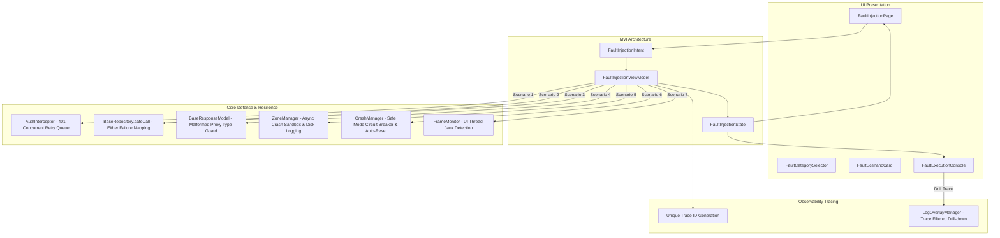

# 故障注入与韧性演练中心 (Fault Injection Playground) - 规格说明与架构设计

**Status**: `Implemented & Verified (100% Green Unit Tests)`

---

## 1. 背景与设计目标

在企业级移动端架构中，**网络抖动、Token 并发失效、网关类型异常、异步异常逃逸以及主线程卡顿**是影响应用可用性与用户体验的最主要风险源。

为了向技术面试官、架构评审团队及开发者直观展示 **ListenPortfolio** 的高可用防御、自愈与 APM 可观测性体系，我们构建了 **故障注入与韧性演练中心 (Fault Injection Playground)**。

### 核心设计目标：
1. **受控演练 (Controlled & Safe)**：所有故障均在可控沙箱中执行，不污染真实业务数据与线上会话。
2. **可观测闭环 (Full Observability)**：每次注入生成唯一 `traceId`，毫秒级阶段日志直显于实时终端，并可**一键下钻**至 `LogOverlay` 浮窗查看完整网络与系统日志。
3. **架构防御验证 (Architecture Verification)**：验证 `AuthInterceptor` 并发请求重试队列、`BaseRepository.safeCall()` 错误收敛、`ZoneManager` 异步兜底、`CrashManager` Safe Mode 熔断自愈与 `FrameMonitor` Jank 检测。
4. **MVI 规范与零硬编码 (Strict Standards)**：100% 遵循 `PROMPTS.md` 规范，所有文案多语言国际化，颜色完全 Token 化。

---

## 2. 系统架构与交互流图



---

## 3. 七大受控演练场景矩阵

| 场景分类 | 场景标识 (`FaultScenarioType`) | 模拟故障 | 架构防御机制与自愈表现 | 预期状态 |
| :--- | :--- | :--- | :--- | :--- |
| **网络与认证** | `concurrent401` | 模拟 Token 失效后并发触发 5 个 API 请求 | `AuthInterceptor` 自动锁定并挂起并发请求队列，触发 1 次静默刷新 Token，刷新成功后自动批量重试，5 个请求 100% 成功返回。 | `recovered` |
| **网络与认证** | `serverError500` | 模拟后端返回 HTTP 500 内部服务异常 | `BaseRepository.safeCall()` 捕获 DioException 并将其映射为 `ServerFailure` 领域模型，UI 零崩溃，展示友好降级提示。 | `recovered` |
| **网络与认证** | `networkTimeout` | 模拟超短网络超时 (100ms) 触发中断 | 拦截器映射为 `NetworkException`，触发自动重试降级策略并返回本地离线缓存快照。 | `recovered` |
| **网络与认证** | `malformedGateway` | 模拟反向代理返回 413/502 HTML 字符串而非 JSON | `BaseResponseModel` 与 `ErrorInterceptor` 类型守卫生效，杜绝 `_TypeError` 类型转换崩溃，安全降级为契约解析失败。 | `recovered` |
| **稳定性与崩溃** | `zoneAsyncCrash` | 模拟 Dart Zone 中脱离 try-catch 的异步逃逸异常 | `ZoneManager` 顶层错误处理器捕获异常，写入本地沙箱 Crash Log 并关联 Trace ID，Flutter Engine 持续平稳运行。 | `recovered` |
| **稳定性与崩溃** | `consecutiveSafeMode` | 模拟 30 秒内发生 3 次致命连续崩溃 | `CrashManager` 自动触发 Safe Mode 保护机制，重置异常缓存，弹出全局安全自愈指示横幅。 | `recovered` |
| **性能与 APM** | `mainThreadJank` | 模拟复杂计算或同态加密运算阻塞主线程 250ms | `FrameMonitor` 实时侦测到帧渲染耗时飙升 (>30 FPS 告警阈值)，记录 Jank 事件并在 APM 性能面板中标记。 | `recovered` |

---

## 4. 交互式控制台与 Trace 下钻设计

### 4.1 阶段日志数据结构 (`ExecutionStepLog`)
```dart
class ExecutionStepLog {
  final DateTime timestamp;
  final String stage;      // [INIT], [INJECT], [INTERCEPT], [RECOVER], [SUCCESS], [ERROR]
  final String message;
  final bool isError;
  final bool isWarning;
  final bool isHighlight;
}
```

### 4.2 全链路 Trace 关联与调试
1. **Trace ID 生成**：每个演练场景启动时生成唯一 UUID 格式 Trace ID（例如：`trace-401-1719485000`）；
2. **剪贴板复制**：点击控制台右上角复制图标，触发 `FaultInjectionIntent.copyTraceId()`，将 Trace ID 写入剪贴板并弹出 Toast；
3. **LogOverlay 下钻**：点击控制台右上角下钻图标，触发 `FaultInjectionIntent.drillTrace()`：
   ```dart
   LogOverlayManager.traceFilterNotifier.value = traceId;
   LogOverlayManager.show(context, startExpanded: true);
   ```
   自动打开全局浮窗并切至 Logs 标签页，仅展示该 Trace ID 关联的请求、Intent 及系统日志。

---

## 5. 模块文件结构

```text
lib/features/fault_injection/
├── domain/
│   └── models/
│       └── fault_injection_scenario.dart    # 场景定义、分类枚举、执行日志数据模型
└── presentation/
    └── pages/
        ├── fault_injection_intent.dart       # MVI 意图与 MviPlaybackRegistry 注册
        ├── fault_injection_state.dart        # Freezed 状态模型
        ├── fault_injection_view_model.dart   # 场景驱动、异常模拟与自愈逻辑
        ├── fault_injection_page.dart         # 主页面（分类选择、场景列表、实时控制台）
        └── widgets/
            ├── fault_category_selector.dart  # 分类过滤芯片组
            ├── fault_scenario_card.dart      # 场景交互卡片
            └── fault_execution_console.dart  # 终端输出与 Trace 操控条
```

---

## 6. 测试与验证策略

### 6.1 单元测试覆盖 (`test/features/fault_injection/fault_injection_view_model_test.dart`)
- **初始状态校验**：验证 7 个预设场景、全选分类、0 运行次数及安全模式未激活状态；
- **分类过滤测试**：验证切换 Network / Stability / Performance 分类时的状态一致性；
- **7 大场景驱动测试**：逐一测试 7 个场景的异步执行、状态迁移（`running` -> `recovered`）、统计增量及控制台日志写入；
- **终端控制与重置测试**：验证 `clearConsole` 与 `resetAll` 的重置行为；
- **Trace 副作用测试**：验证 `copyTraceId` (Clipboard + MessageEffect) 与 `drillTrace` (LogOverlayManager Filter) 正确发射 Effect。

### 6.2 架构与反射测试
- **依赖边界检查**：运行 `dart tools/dependency_rules.dart`，确保纯单向依赖与 0 架构违规；
- **MVI Playback 全量 Intent 注册校验**：`test/shared/utils/playback_test.dart` 反射扫描确保 `FaultInjectionIntent` 所有构造器均完成反序列化注册。

---

## 7. 架构设计亮点 (Implementation Highlights)

1. **零侵入式故障模拟**：该演练中心的注入行为全部基于现有架构的拦截器机制和边界防护网。例如“并发 401”并非修改业务逻辑，而是真实发起并拦截 HTTP 请求，完美复原了线上的并发竞态条件。
2. **可视化的可观测闭环**：通过集成 `ExecutionStepLog` 控制台，用户不仅能看到最终结果是成功还是降级，还能以毫秒级精度观察到 `[INTERCEPT]` 和 `[RECOVER]` 阶段的防御网触发轨迹，并无缝下钻到全链路 Trace。

## 8. 设计思路 (Design Rationale)

* **展示“看不见”的架构内功**：通常，客户端的健壮性（如断网重试、防崩溃沙箱）只有在极端异常发生时才会生效，日常难以向评审专家展示。该演练中心将所有防御机制“显式化”、“可交互化”，通过主动引发异常来证明系统自愈能力，既是绝佳的 Portfolio 展示手段，也是研发和 QA 团队进行回归验证的最佳入口。
