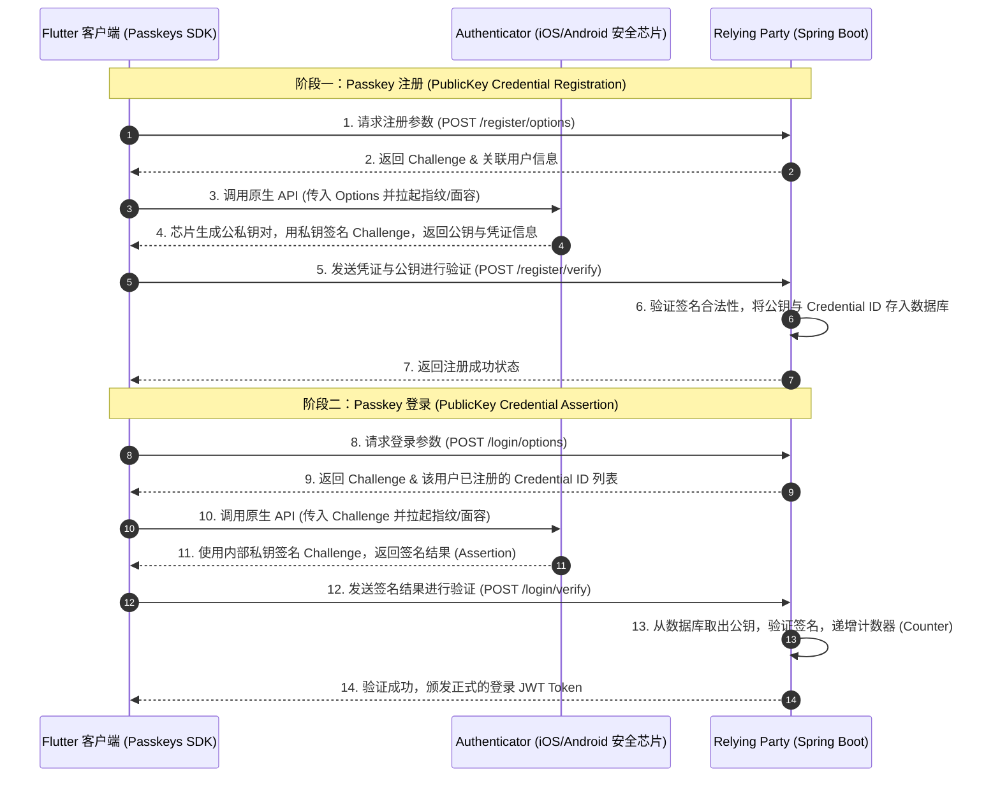

# FIDO2 / Passkey 免密认证系统 - 详细设计与实现方案 (Java Spring Boot)

> [!IMPORTANT]
> **Status: 设计方案 (Design Only) — 尚未实现**
> 本文档为架构设计方案文档，客户端 FIDO2 功能**尚未落地**。当前 `pubspec.yaml` 中未包含 `passkeys` 依赖，`lib/features/auth/domain/passkey_service.dart` 文件不存在。后端 Spring Boot 服务的 WebAuthn 集成亦未启动。

本文档详细阐述了在 **ListenPortfolio** 项目中引入 **FIDO2 / Passkey（通行密钥）** 实现金融级安全免密登录的完整设计方案。本方案涵盖了前端 Flutter 客户端与后端 Java (Spring Boot) 服务的联动交互流程、数据库结构设计、接口规范及安全性分析。

---

## 1. 系统总体架构

FIDO2 认证系统由以下三部分组成：
1. **FIDO2 客户端 (Flutter App)**：利用设备的原生安全芯片（如 iOS 的 Secure Enclave / Android KeyStore）生成并管理非对称密钥对，通过系统级生物识别（Face ID / 指纹）授权私钥签名。
2. **Relying Party (RP, Spring Boot 后端服务)**：作为依赖方，负责生成随机挑战码（Challenge）、保存用户的公钥，并在认证时使用公钥验证客户端的数字签名。
3. **Authenticator (设备安全模块)**：手机硬件芯片，负责私钥存储与物理级的加解密计算。



---

## 2. 后端技术选型与数据模型 (Java)

### 2.1 技术选型
* **Maven 依赖**：选用硬件安全钥匙巨头 Yubico 官方维护的 **`java-webauthn-server`** (或使用 **`webauthn4j-core`**)。它完全符合 W3C WebAuthn 规范，处理底层复杂的 COSE 公钥格式解析及非对称加密算法验证。

在 `ListenPortfolioBackend` 的 `pom.xml` 中引入：
```xml
<dependency>
    <groupId>com.yubico</groupId>
    <artifactId>webauthn-server-core</artifactId>
    <version>2.5.0</version>
</dependency>
```

### 2.2 数据库实体设计：`UserPasskey` (JPA Entity)
为了支持一个用户绑定多个设备（如 iPad、iPhone、Android 手机），建立一对多的凭证存储表。

```java
@Entity
@Table(name = "user_passkeys")
@Data
public class UserPasskey {
    @Id
    @GeneratedValue(generator = "UUID")
    @GenericGenerator(name = "UUID", strategy = "org.hibernate.id.UUIDGenerator")
    private String id;

    @Column(name = "user_id", nullable = false)
    private String userId;

    // Base64URL 编码的 Credential ID
    @Column(name = "credential_id", nullable = false, unique = true)
    private String credentialId;

    // 二进制存储的公钥数据 (COSE 格式)
    @Lob
    @Column(name = "public_key", nullable = false)
    private byte[] publicKey;

    // 计数器，用于防御重放攻击
    @Column(name = "counter", nullable = false)
    private long counter;

    @Column(name = "device_type")
    private String deviceType;

    @Column(name = "created_at")
    private LocalDateTime createdAt = LocalDateTime.now();

    @Column(name = "last_used_at")
    private LocalDateTime lastUsedAt;
}
```

---

## 3. 后端 API 接口设计 (Spring Boot)

### 3.1 凭证注册接口

#### A. 获取注册参数
* **路径**：`POST /v1/auth/passkey/register/options`
* **鉴权**：Bearer JWT Token（注册前需已通过常规登录）
* **返回 (JSON)**：
  ```json
  {
    "code": 200,
    "data": {
      "rp": { "name": "ListenPortfolio", "id": "listen-portfolio.com" },
      "user": { "id": "user_12345", "name": "listen2code@gmail.com", "displayName": "Listen" },
      "challenge": "G39sa..._random_challenge_string_...",
      "pubKeyCredParams": [
        { "type": "public-key", "alg": -7 }, // ES256 (常用的椭圆曲线算法)
        { "type": "public-key", "alg": -257 } // RS256
      ],
      "timeout": 60000,
      "authenticatorSelection": {
        "authenticatorAttachment": "platform", // 仅使用设备内置生物识别（指纹/面容）
        "userVerification": "required"
      }
    }
  }
  ```

#### B. 验证注册凭证
* **路径**：`POST /v1/auth/passkey/register/verify`
* **Java Controller 伪代码**：
```java
@RestController
@RequestMapping("/v1/auth/passkey")
public class PasskeyRegisterController {

    @Autowired
    private RelyingParty relyingParty; // Yubico 提供的 RP 实例
    
    @Autowired
    private PasskeyService passkeyService;

    @PostMapping("/register/verify")
    public ResponseEntity<?> verifyRegister(@RequestBody String responseJson, Principal principal) {
        try {
            // 1. 从已登录的 Principal 获取当前用户 ID
            String userId = principal.getName();
            
            // 2. 解析客户端返回的凭证数据
            RegistrationResult result = relyingParty.finishRegistration(
                FinishRegistrationOptions.builder()
                    .request(getStoredCreationOptions(userId)) // 读取第A步缓存在 Session/Cache 中的 options
                    .response(PublicKeyCredential.parseRegistrationResponseJson(responseJson))
                    .build()
            );
            
            // 3. 保存凭证公钥与 Credential ID 到数据库
            passkeyService.saveCredential(userId, result);
            
            return ResponseEntity.ok(ApiResponse.success("Passkey registered successfully"));
        } catch (RegistrationFailedException e) {
            return ResponseEntity.status(400).body(ApiResponse.error("Registration validation failed"));
        }
    }
}
```

---

### 3.2 凭证登录（免密）接口

#### A. 获取登录参数
* **路径**：`POST /v1/auth/passkey/login/options`
* **Body 参数**：（由于是免密登录，需输入邮箱或用户名来查找已注册的凭证）
  ```json
  {
    "email": "listen2code@gmail.com"
  }
  ```
* **返回 (JSON)**：
  ```json
  {
    "code": 200,
    "data": {
      "challenge": "T92sd..._login_challenge_...",
      "timeout": 60000,
      "allowCredentials": [
        { "id": "ARe93...credential_id_1...", "type": "public-key" }
      ],
      "userVerification": "required"
    }
  }
  ```

#### B. 验证登录签名
* **路径**：`POST /v1/auth/passkey/login/verify`
* **Java Controller 伪代码**：
```java
@PostMapping("/login/verify")
public ResponseEntity<?> verifyLogin(@RequestBody String assertionJson) {
    try {
        PublicKeyCredential<AuthenticatorAssertionResponse, ClientAssertionExtensionOutputs> assertion = 
            PublicKeyCredential.parseAssertionResponseJson(assertionJson);
            
        // 1. 根据 Credential ID 从数据库中查找对应的公钥和计数器
        String credentialId = assertion.getId().getBase64Url();
        UserPasskey storedKey = passkeyService.findByCredentialId(credentialId);
        
        // 2. 使用 Yubico 提供的 RP 进行签名校验
        AssertionResult result = relyingParty.finishAssertion(
            FinishAssertionOptions.builder()
                .request(getStoredRequestOptions(storedKey.getUserId())) // 匹配刚才生成的 challenge
                .response(assertion)
                .credentialRepository(new JPAUserCredentialRepository(storedKey)) // 提供校验公钥的仓储层
                .build()
        );
        
        if (result.isSuccess()) {
            // 3. 防重放攻击校验：检查计数器是否严格递增
            if (assertion.getResponse().getSignatureCount() <= storedKey.getCounter()) {
                throw new SecurityException("Counter did not increase. Potential replay attack!");
            }
            // 4. 更新数据库中的计数器与最后使用时间
            passkeyService.updateCounter(credentialId, assertion.getResponse().getSignatureCount());
            
            // 5. 生成 JWT Access Token & Refresh Token 并返回
            TokenPair tokenPair = jwtService.generateTokens(storedKey.getUserId());
            return ResponseEntity.ok(ApiResponse.success(tokenPair));
        }
    } catch (Exception e) {
        return ResponseEntity.status(401).body(ApiResponse.error("Biometric authentication failed"));
    }
    return ResponseEntity.status(401).build();
}
```

---

## 4. Flutter 客户端实现方案

### 4.1 技术选型与依赖
* **Flutter SDK 依赖包**：选用 [passkeys](https://pub.dev/packages/passkeys) 包（基于原生 Android Credential Manager 与 iOS ASAuthorizationController 封装）。

### 4.2 客户端核心层设计

#### A. 凭证管理器封装 (`lib/features/auth/domain/passkey_service.dart`)
```dart
import 'package:passkeys/passkeys.dart';

class PasskeyService {
  final PasskeyAuthenticator _authenticator = PasskeyAuthenticator();

  // 1. 注册 Passkey
  Future<RegisterResult> register({
    required String challenge,
    required String rpId,
    required String userId,
    required String userName,
  }) async {
    try {
      final response = await _authenticator.register(
        RegisterOptions(
          challenge: challenge,
          relyingParty: RelyingParty(id: rpId, name: "ListenPortfolio"),
          user: User(id: userId, name: userName, displayName: userName),
          authenticatorSelection: AuthenticatorSelection(
            userVerification: UserVerification.required,
            authenticatorAttachment: AuthenticatorAttachment.platform,
          ),
        ),
      );
      return RegisterResult.success(response);
    } catch (e) {
      return RegisterResult.failure(e.toString());
    }
  }

  // 2. 使用 Passkey 登录
  Future<LoginResult> authenticate({
    required String challenge,
    required String rpId,
    List<String>? allowedCredentialIds,
  }) async {
    try {
      final response = await _authenticator.authenticate(
        AuthenticateOptions(
          challenge: challenge,
          relyingPartyId: rpId,
          allowedCredentials: allowedCredentialIds?.map((id) => Credential(id: id)).toList(),
          userVerification: UserVerification.required,
        ),
      );
      return LoginResult.success(response);
    } catch (e) {
      return LoginResult.failure(e.toString());
    }
  }
}
```

---

## 5. 安全性防护考量

1. **计数器防重放 (Signature Counter)**：
   * 每次验证成功后，后端会读取芯片返回的 `signatureCount` 并对比数据库，确保其严格大于上一次记录。若黑客录制了本次签名的通信数据包并尝试重复发送，由于计数器未递增，Spring Boot 校验会直接拦截。
2. **域名/包名防劫持 (Phishing Resistance)**：
   * iOS 与 Android 在拉起原生 FIDO 框架时，会强制请求服务端的 `/.well-known/assetlinks.json` (Android) 或 `/apple-app-site-association` (iOS) 文件。由于域名校验是系统级强绑定的，即使黑客仿造了一个一模一样的钓鱼 App，由于无法修改正规域名的 AASA 配置，也绝对无法读取或利用存储在安全芯片中的私钥。
3. **敏感操作风控升级**：
   * 在支付或修改密码时，可以要求用户必须重新触发一次 FIDO2 校验作为“二次确认授权签名”，保障重要行为的不可抵赖性（Non-repudiation）。
