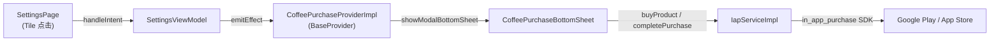
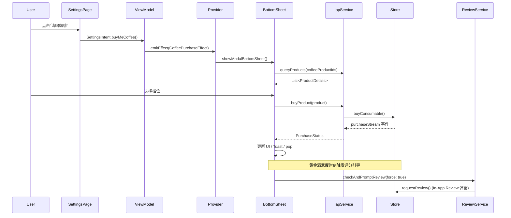
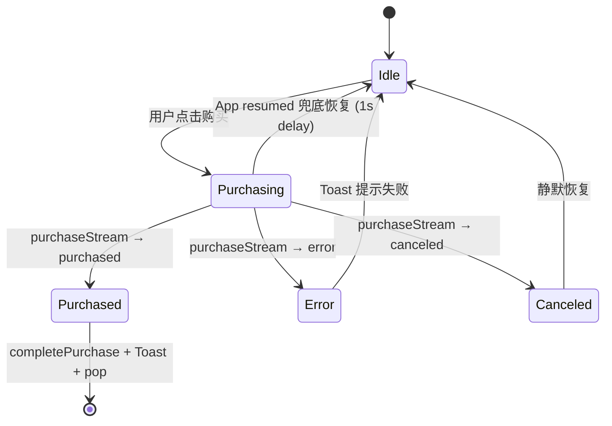

# ☕ In-App Purchase — "请喝咖啡" 设计与实现文档

> **功能概述**：在 Settings 页面提供"请喝咖啡"入口，用户点击后弹出 BottomSheet，展示 3 个档位的消耗型商品（coffee1 / coffee2 / coffee3），通过 Google Play / App Store 完成真实支付。
>
> **版本**：v1.0.18 &nbsp;|&nbsp; **依赖**：`in_app_purchase` + `in_app_purchase_android`

---

## 目录

1. [系统架构](#1-系统架构)
2. [数据流与状态机](#2-数据流与状态机)
3. [核心实现](#3-核心实现)
4. [关键文件索引](#4-关键文件索引)
5. [沙盒测试配置](#5-沙盒测试配置)
6. [测试覆盖](#6-测试覆盖)
7. [扩展指引](#7-扩展指引)

---

## 1. 系统架构

采用 **Clean Architecture + MVI** 模式，支付底座封装在 Service 层，View 层通过 Effect 解耦触发：



**设计要点**：

- `SettingsPage` 不直接引用 BottomSheet，仅发出 `SettingsIntent.buyMeCoffee()`。
- `SettingsViewModel` 将 Intent 映射为 `CoffeePurchaseEffect` 并通过 `emitEffect` 发布。
- `CoffeePurchaseProviderImpl` 作为全局 `BaseProvider<CoffeePurchaseEffect>` 接收 Effect，从 `AppNavConfig.context` 获取安全上下文后弹出 BottomSheet。
- `IapServiceImpl` 封装所有平台差异（如 Android 需要额外 `consumePurchase`）。

---

## 2. 数据流与状态机

### 2.1 MVI 单向数据流



### 2.2 购买状态流转



---

## 3. 核心实现

### 3.1 IAP 抽象接口

`IIapService` 定义了 5 个核心方法，使业务层与具体 SDK 解耦：

| 方法 | 职责 |
|---|---|
| `initialize()` | App 启动时检查商店可用性 |
| `queryProducts(Set<String>)` | 按 ID 查询商品详情（名称、价格、描述） |
| `buyProduct(ProductDetails)` | 发起消耗型购买 (`buyConsumable`) |
| `purchaseStream` | 购买状态事件流（purchased / error / canceled） |
| `completePurchase(PurchaseDetails)` | 完成交易（Android 额外执行 `consumePurchase`） |

### 3.2 Android 消耗型商品处理

Google Play 要求消耗型商品在交付后显式调用 `consumePurchase`，否则会阻止同一商品的再次购买：

```dart
// iap_service_impl.dart
if (Platform.isAndroid) {
  final androidAddition =
      _iap.getPlatformAddition<InAppPurchaseAndroidPlatformAddition>();
  await androidAddition.consumePurchase(purchase);
}
await _iap.completePurchase(purchase);
```

### 3.3 商品标题清洗

Google Play 返回的 `product.title` 会携带包名后缀（如 `请喝一杯咖啡 (com.listenxxx)`），通过正则移除：

```dart
// coffee_purchase_bottom_sheet.dart — _cleanTitle()
final match = RegExp(r'\s*\([^)]*\)$');
return title.replaceAll(match, '').trim();
```

### 3.4 生命周期兜底恢复

部分设备在用户按系统返回键关闭原生支付弹窗时，不会向 `purchaseStream` 广播 `canceled` 事件，导致按钮卡在 Loading 状态。通过 `WidgetsBindingObserver` 实现安全恢复：

```dart
// coffee_purchase_bottom_sheet.dart
@override
void didChangeAppLifecycleState(AppLifecycleState state) {
  if (state == AppLifecycleState.resumed) {
    Future.delayed(const Duration(milliseconds: 1000), () {
      if (mounted && _isPurchasing) {
        setState(() {
          _isPurchasing = false;
          _purchasingProductId = null;
        });
      }
    });
  }
}
```

**1 秒延迟**是为了给 `purchaseStream` 留出最后的派发窗口 — 若购买成功，`purchased` 回调会先执行并 `pop` 掉 BottomSheet，此处的恢复逻辑就不会触发。

### 3.5 多语言文案

| Key | EN | ZH | JA |
|---|---|---|---|
| `buyMeCoffee` | Buy me a Coffee | 请喝咖啡 | コーヒーをおごる |
| `selectAmount` | Support the Author | 请作者喝杯咖啡吧 | 作者にコーヒーをおごる |
| `buyCoffeeSuccess` | Thank you for your support! | 感谢您的支持！ | ご支援ありがとうございます！ |
| `buyCoffeeFailed` | Purchase failed | 购买失败 | 購入に失敗しました |

### 3.6 商品配置

在 `AppConstants` 中集中管理，与 Google Play Console 中的 Product ID 一一对应：

```dart
// app_constants.dart
static const String coffeeTier1 = 'coffee1';
static const String coffeeTier2 = 'coffee2';
static const String coffeeTier3 = 'coffee3';
static const Set<String> coffeeProductIds = {coffeeTier1, coffeeTier2, coffeeTier3};
```

BottomSheet 根据 Tier 级别匹配不同图标：

| Tier | 图标 |
|---|---|
| coffee1 | ☕ `Icons.coffee` |
| coffee2 | ☕ `Icons.coffee_maker` |
| coffee3 | 🔥 `Icons.local_fire_department_rounded` |

---

## 4. 关键文件索引

### Service 层

| 文件 | 职责 |
|---|---|
| [iap_service.dart](file:///c:/Users/liste/Downloads/github/ListenPortfolioFlutter/lib/shared/services/iap/iap_service.dart) | `IIapService` 抽象接口定义 |
| [iap_service_impl.dart](file:///c:/Users/liste/Downloads/github/ListenPortfolioFlutter/lib/shared/services/iap/iap_service_impl.dart) | 平台实现（Android consumePurchase + 双端 completePurchase） |
| [review_service.dart](file:///c:/Users/liste/Downloads/github/ListenPortfolioFlutter/lib/shared/services/review/review_service.dart) | 提供应用内评价及频率控流服务 |

### MVI 层

| 文件 | 职责 |
|---|---|
| [settings_intent.dart](file:///c:/Users/liste/Downloads/github/ListenPortfolioFlutter/lib/features/settings/presentation/pages/settings_intent.dart) | `buyMeCoffee` Intent 定义 |
| [settings_view_model.dart](file:///c:/Users/liste/Downloads/github/ListenPortfolioFlutter/lib/features/settings/presentation/pages/settings_view_model.dart) | Intent → Effect 映射 |
| [coffee_purchase_provider_impl.dart](file:///c:/Users/liste/Downloads/github/ListenPortfolioFlutter/lib/shared/base/coffee_purchase_provider_impl.dart) | 全局 Effect 监听 → BottomSheet 弹出 |

### UI 层

| 文件 | 职责 |
|---|---|
| [coffee_purchase_bottom_sheet.dart](file:///c:/Users/liste/Downloads/github/ListenPortfolioFlutter/lib/features/settings/presentation/pages/components/coffee_purchase_bottom_sheet.dart) | BottomSheet UI、购买流程控制、生命周期兜底恢复 |
| [settings_page.dart](file:///c:/Users/liste/Downloads/github/ListenPortfolioFlutter/lib/features/settings/presentation/pages/settings_page.dart) | Settings 页面入口 Tile |

### 配置与国际化

| 文件 | 职责 |
|---|---|
| [app_constants.dart](file:///c:/Users/liste/Downloads/github/ListenPortfolioFlutter/lib/shared/constants/app_constants.dart) | 商品 ID 常量 |
| [translations_key.dart](file:///c:/Users/liste/Downloads/github/ListenPortfolioFlutter/lib/shared/i18n/translations_key.dart) | i18n Key 定义 |
| [zh.dart](file:///c:/Users/liste/Downloads/github/ListenPortfolioFlutter/lib/shared/i18n/languages/zh.dart) / [ja.dart](file:///c:/Users/liste/Downloads/github/ListenPortfolioFlutter/lib/shared/i18n/languages/ja.dart) | 中文 / 日文翻译 |

---

## 5. 沙盒测试配置

### Google Play License Testing

1. 打开 **Google Play Console** → **设置** → **License Testing**
2. 添加测试账号的 Gmail 地址
3. 手机上使用该 Gmail 登录 Google Play
4. 购买时会自动出现 **"Test card, always approves"**，不会产生真实扣款

> **注意**：手机的 Google Play 地区需要与商品配置的可用地区一致，否则商品列表会返回空。例如手机设置中文（中国），但商品仅配置日本区域时，需将系统语言切换为日文或将 Google 账号地区改为日本。

### 验证要点

- [ ] 商品列表正常加载（3 个档位，按价格升序排列）
- [ ] 点击购买后弹出原生支付弹窗，选择测试卡片
- [ ] 购买成功：Toast 提示 + BottomSheet 自动关闭
- [ ] 购买取消 / 返回键关闭：按钮恢复可点击状态
- [ ] 重复购买同一档位：消耗型商品可无限次购买

---

## 6. 测试覆盖

- **单元测试**：覆盖 `IapServiceImpl` 的 `queryProducts`、`buyProduct`、`completePurchase` 路径（含异常）
- **集成测试**：使用 `MockPlatformIap` 模拟购买流程，验证 `WidgetsBindingObserver` 兜底恢复
- **CI**：`flutter test` 已集成至 GitHub Actions，300+ 测试全绿

---

## 7. 扩展指引

| 场景 | 操作 |
|---|---|
| **新增商品档位** | Google Play Console 添加商品 → `AppConstants` 添加 Tier 常量 → 更新 `coffeeProductIds` 集合 |
| **新增语言** | `translations_key.dart` 添加 Key → 对应语言文件补全翻译，无需改动业务逻辑 |
| **适配新平台** | 实现 `IIapService` 新子类 → 在 `app_initializer.dart` 中按平台注册 |
| **升级 IAP SDK** | 检查 `buyConsumable` / `consumePurchase` API 兼容性 → 运行全量测试 |

---

*最后更新：2026-06-18*
