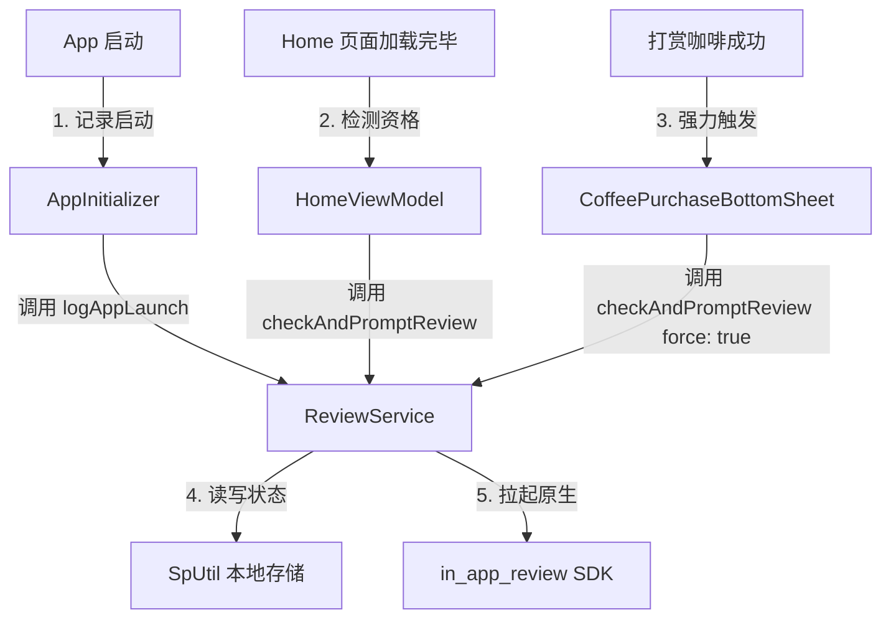
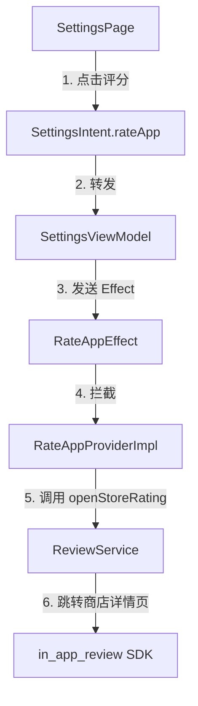

# App内评分 (In-App Review) 设计与实现方案

本文档详细介绍了项目中已实现的应用内评分 (In-App Review) 系统。该系统封装了原生应用商店的评分 API，并引入了基于使用频次的本地限流规则，以确保符合 App Store 与 Google Play 的频率调控策略 (Quota Limits)，提供最佳的用户体验。

---

## 1. 业务目标与限流规范

应用商店（特别是 Google Play）对应用内弹出评分弹窗有严格的频次限制（例如每用户每年只能弹出几次，超出后 API 将直接静默返回成功但并不显示任何弹窗）。

为了不浪费宝贵的原生评分弹出机会，本方案制定了以下限流条件：
1. **启动频次限制**：用户必须启动 App 至少 **5次**。
2. **时间间隔限制**：距上一次尝试弹出评分弹窗的时间必须超过 **90天**。
3. **状态去重**：如果用户已经评分成功（或点击了显式评分），则不再主动弹出。
4. **黄金触发点 (Force Bypass)**：当用户完成一次正向互动体验（如打赏咖啡）后，立即强制拉起评分（绕过上述启动频次和时间限制）。

---

## 2. 系统架构与调用流

评分系统分为“自动触发流”和“手动触发流”。

### 2.1 自动触发流 (启动/转化事件触发)


### 2.2 手动评分流 (设置菜单触发)
当用户显式在设置页面点击“去评分”时，不能受频次限制约束，必须 100% 成功跳转到对应平台的应用商店详情页。



---

## 3. 核心代码设计

应用内评分系统由一个服务单例和两个业务拦截器组成。

### 3.1 评分服务单例 `ReviewService`
在 [review_service.dart](file:///c:/Users/liste/Downloads/github/ListenPortfolioFlutter/lib/shared/services/review/review_service.dart) 中管理启动计数、时间比较和 API 调用：
```dart
class ReviewService {
  static final ReviewService _instance = ReviewService._internal();
  static final int limitCount = 5;  // 最小启动次数
  static final int limitDays = 90;  // 最小时间间隔天数

  factory ReviewService() => _instance;
  ReviewService._internal();

  final InAppReview _inAppReview = InAppReview.instance;

  /// 记录启动事件，在应用初始化时调用
  Future<void> logAppLaunch() async {
    final count = SpUtil.getInt(AppConstants.appLaunchCountKey) ?? 0;
    await SpUtil.put(AppConstants.appLaunchCountKey, count + 1);
  }

  /// 记录用户已评分状态
  Future<void> markAsRated() async {
    await SpUtil.put(AppConstants.hasReviewKey, true);
  }

  /// 直接拉起原生应用内评分弹窗
  Future<void> requestReviewDirectly() async {
    try {
      final isAvailable = await _inAppReview.isAvailable();
      if (isAvailable) {
        await _inAppReview.requestReview();
        await markAsRated(); // 标记已弹出，避免短期重复打扰
      } else {
        appLogger.w('ReviewService: In-app review is not available on this device.');
      }
    } catch (e) {
      appLogger.e('ReviewService: Failed to request in-app review: $e');
    }
  }

  /// 跳转至应用商店本应用的 Listing 详情页（用于手动打分入口）
  Future<void> openStoreRating() async {
    try {
      await _inAppReview.openStoreListing(
        appStoreId: AppConstants.appStoreId,
      );
      await markAsRated();
    } catch (e) {
      appLogger.e('ReviewService: Failed to open store listing: $e');
    }
  }

  /// 过滤频次限制并尝试拉起评分弹窗
  /// [force] 设为 true 时可以绕过启动计数和时间跨度验证
  Future<void> checkAndPromptReview({bool force = false}) async {
    if (force) {
      await requestReviewDirectly();
      return;
    }

    // 1. 是否已经评过分
    final hasRated = SpUtil.getBool(AppConstants.hasReviewKey, defaultValue: false);
    if (hasRated) {
      appLogger.d('ReviewService: User has already rated. Skipping prompt.');
      return;
    }

    // 2. 检查启动次数是否达到 5 次
    final launchCount = SpUtil.getInt(AppConstants.appLaunchCountKey) ?? 0;
    if (launchCount < limitCount) {
      appLogger.d('ReviewService: Launch count ($launchCount) is less than 5. Skipping.');
      return;
    }

    // 3. 检查距上一次弹窗是否间隔 90 天
    final lastPromptTime = SpUtil.getInt(AppConstants.lastReviewPromptTimeKey) ?? 0;
    final now = DateTime.now().millisecondsSinceEpoch;
    final int ninetyDaysMs = limitDays * 24 * 60 * 60 * 1000;
    if (lastPromptTime > 0 && (now - lastPromptTime) < ninetyDaysMs) {
      appLogger.d('ReviewService: Less than 90 days since last prompt. Skipping.');
      return;
    }

    // 通过限流，拉起原生弹窗并更新时间记录
    appLogger.i('ReviewService: Rate limits passed. Prompting in-app review dialog.');
    await SpUtil.put(AppConstants.lastReviewPromptTimeKey, now);
    await requestReviewDirectly();
  }
}
```

### 3.2 启动时注册与记录
- **记录启动**：在 [app_initializer.dart](file:///c:/Users/liste/Downloads/github/ListenPortfolioFlutter/lib/shared/utils/app_initializer.dart) 中：
  ```dart
  ReviewService().logAppLaunch();
  ```
- **首屏静默检测**：在 [home_view_model.dart](file:///c:/Users/liste/Downloads/github/ListenPortfolioFlutter/lib/features/home/presentation/pages/home_view_model.dart) 的首屏初始化阶段：
  ```dart
  ReviewService().checkAndPromptReview();
  ```

---

## 4. 数据持久化项 (`SpUtil`)

本方案通过本地 Key-Value 存储以下状态项，定义在 [app_constants.dart](file:///c:/Users/liste/Downloads/github/ListenPortfolioFlutter/lib/shared/constants/app_constants.dart)：
- `AppConstants.appLaunchCountKey` (`'app_launch_count'`): 累积启动次数。
- `AppConstants.hasReviewKey` (`'has_review_rated'`): 是否已经有过评分操作（为 true 则永久不自动打扰）。
- `AppConstants.lastReviewPromptTimeKey` (`'last_review_prompt_time'`): 上次拉起评分弹窗的毫秒级时间戳。

---

## 5. 测试与环境验证

### 5.1 Google Play (Android)
- **注意**：应用内评分 API 在 Android 的 Debug 安装包下**不能拉起真实弹窗**。
- **验证方法**：
    1. 将应用发布到 Google Play 的 **内部测试轨道 (Internal Testing)**。
    2. 确保测试设备登录的 Google 账号在测试人员名单中。
    3. 执行触发逻辑（例如完成打赏），原生评分对话框即可成功拉起。

### 5.2 App Store (iOS)
- **Debug/Simulator**：在模拟器或真机 Debug 模式下，每次调用 `requestReview()` 都会**必定弹出**评分弹窗，可以反复验证 UI。但点击弹窗中的“提交”按钮不会产生真实提交。
- **TestFlight/Production**：在 TestFlight 包中，评分 API 不会拉起任何弹窗（这是苹果为了防刷分所作的严格频次拦截）。

---

## 6. 关联源文件

| 文件 | 作用说明 |
|---|---|
| [review_service.dart](file:///c:/Users/liste/Downloads/github/ListenPortfolioFlutter/lib/shared/services/review/review_service.dart) | 核心服务类，包含限流验证及 SDK 调用。 |
| [rate_app_provider_impl.dart](file:///c:/Users/liste/Downloads/github/ListenPortfolioFlutter/lib/shared/base/rate_app_provider_impl.dart) | 监听 `RateAppEffect` 并跳转商店详情页。 |
| [settings_view_model.dart](file:///c:/Users/liste/Downloads/github/ListenPortfolioFlutter/lib/features/settings/presentation/pages/settings_view_model.dart) | 将设置页面评分点击转换为 Effect 抛出。 |
| [coffee_purchase_bottom_sheet.dart](file:///c:/Users/liste/Downloads/github/ListenPortfolioFlutter/lib/features/settings/presentation/pages/components/coffee_purchase_bottom_sheet.dart) | 打赏成功后调用 `checkAndPromptReview(force: true)` 强行触发。 |
