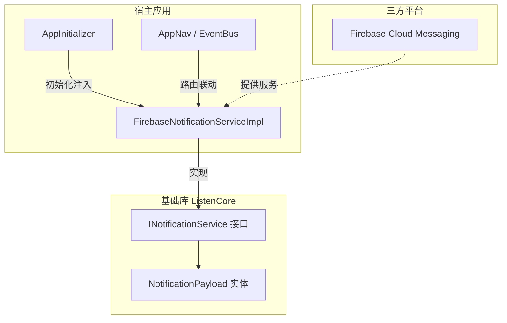
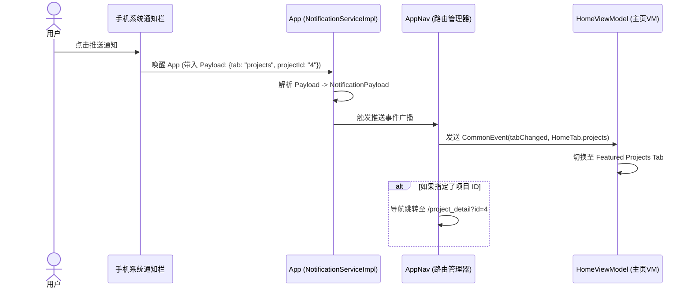

# 推送通知集成与抽象设计方案 (Push Notification Specification)

为了在作品集 App 中实现推送通知能力，同时保持基础库（`ListenCore`）与具体第三方推送平台（`Firebase Cloud Messaging`）的解耦，我们在此设计一套符合整洁架构原则的**推送通知抽象与集成方案**。

---

## 1. 设计目标与原则

* **平台无关性（Decoupling）**：基础库 `ListenCore` 不引入任何具体推送平台的依赖（如 Firebase、极光推送等），仅定义通信协议（接口与数据实体）。
* **生命周期感知**：能够支持 App 在**前台（Foreground）**、**后台（Background）**以及**已终止/未启动（Terminated）**三种状态下的消息接收和点击响应。
* **深度链接路由（Deep Linking）**：支持点击推送通知后自动解析 Payload 载荷，并通过 `AppNav` 与事件总线进行特定页面（如项目详情、CV页）的跳转。

---

## 2. 核心架构设计

我们采用**控制反转（IoC）**的思路，在 `ListenCore` 中提供接口定义与契约，在 `ListenPortfolioFlutter` 中使用 Firebase Cloud Messaging 进行具体实现。



---

## 3. 基础库接口定义 (`ListenCore`)

在 `ListenCore` 的 `lib/services/` 目录下（建议新建 `lib/services/notification_service.dart`）定义以下接口和数据模型：

### 3.1 数据实体定义

```dart
/// 推送通知载荷实体
class NotificationPayload {
  final String title;
  final String body;
  final Map<String, dynamic> data; // 自定义键值对参数

  const NotificationPayload({
    required this.title,
    required this.body,
    this.data = const {},
  });

  factory NotificationPayload.fromJson(Map<String, dynamic> json) {
    return NotificationPayload(
      title: json['title'] as String? ?? '',
      body: json['body'] as String? ?? '',
      data: json['data'] as Map<String, dynamic>? ?? const {},
    );
  }
}
```

### 3.2 抽象服务接口

```dart
import 'notification_payload.dart';

abstract class INotificationService {
  /// 初始化推送服务配置（通道、证书等）
  Future<void> initialize();

  /// 动态申请通知权限（建议在合适的业务场景调用，避免启动强弹）
  Future<bool> requestPermission();

  /// 获取当前设备的推送 Token（用于发送单推）
  Future<String?> getToken();

  /// 监听推送 Token 更新流
  Stream<String> get onTokenRefresh;

  /// 前台收到消息监听器
  Stream<NotificationPayload> get onMessageReceived;

  /// 用户点击推送消息唤醒 App 的监听器（包含后台与冷启动状态）
  Stream<NotificationPayload> get onMessageOpenedApp;
}
```

---

## 4. 宿主应用实现 (`ListenPortfolioFlutter`)

在宿主 App 中，我们使用 Firebase Cloud Messaging (FCM) 与本地通知插件 `flutter_local_notifications` 联合实现该接口。

### 4.1 核心服务实现类

创建 `lib/shared/services/firebase_notification_service_impl.dart`：

```dart
import 'dart:async';
import 'package:firebase_messaging/firebase_messaging.dart';
import 'package:flutter_local_notifications/flutter_local_notifications.dart';
import 'package:listen_core/core.dart'; // 引入接口定义

class FirebaseNotificationServiceImpl implements INotificationService {
  final FirebaseMessaging _fcm = FirebaseMessaging.instance;
  final FlutterLocalNotificationsPlugin _localNotifications = FlutterLocalNotificationsPlugin();

  final StreamController<NotificationPayload> _messageReceivedController = StreamController.broadcast();
  final StreamController<NotificationPayload> _messageOpenedController = StreamController.broadcast();

  @override
  Future<void> initialize() async {
    // 1. 初始化 Android 通知渠道（主要针对前台通知展示）
    const AndroidNotificationChannel channel = AndroidNotificationChannel(
      'portfolio_push_channel',
      'Portfolio Notifications',
      description: 'Used for portfolio updates and interactive messages.',
      importance: Importance.high,
    );

    await _localNotifications
        .resolvePlatformSpecificImplementation<AndroidFlutterLocalNotificationsPlugin>()
        ?.createNotificationChannel(channel);

    // 2. 初始化本地通知插件设置
    const AndroidInitializationSettings androidSettings = AndroidInitializationSettings('@mipmap/ic_launcher');
    const DarwinInitializationSettings iosSettings = DarwinInitializationSettings();
    await _localNotifications.initialize(
      const InitializationSettings(android: androidSettings, iOS: iosSettings),
      onDidReceiveNotificationResponse: _handleLocalNotificationClick,
    );

    // 3. 配置前台通知行为（iOS）
    await _fcm.setForegroundNotificationPresentationOptions(
      alert: true,
      badge: true,
      sound: true,
    );

    // 4. 监听前台 FCM 消息
    FirebaseMessaging.onMessage.listen((RemoteMessage message) {
      final payload = _convertMessage(message);
      _messageReceivedController.add(payload);
      
      // 前台展示横幅通知（Android）
      if (message.notification != null) {
        _showLocalNotification(message, channel);
      }
    });

    // 5. 监听后台点击通知唤醒事件
    FirebaseMessaging.onMessageOpenedApp.listen((RemoteMessage message) {
      _messageOpenedController.add(_convertMessage(message));
    });

    // 6. 处理 App 从 Terminated (冷启动) 状态被点击推送唤醒的场景
    final initialMessage = await _fcm.getInitialMessage();
    if (initialMessage != null) {
      _messageOpenedController.add(_convertMessage(initialMessage));
    }
  }

  @override
  Future<bool> requestPermission() async {
    final settings = await _fcm.requestPermission(
      alert: true,
      badge: true,
      sound: true,
    );
    return settings.authorizationStatus == AuthorizationStatus.authorized;
  }

  @override
  Future<String?> getToken() => _fcm.getToken();

  @override
  Stream<String> get onTokenRefresh => _fcm.onTokenRefresh;

  @override
  Stream<NotificationPayload> get onMessageReceived => _messageReceivedController.stream;

  @override
  Stream<NotificationPayload> get onMessageOpenedApp => _messageOpenedController.stream;

  // 内部辅助方法
  NotificationPayload _convertMessage(RemoteMessage message) {
    return NotificationPayload(
      title: message.notification?.title ?? '',
      body: message.notification?.body ?? '',
      data: message.data,
    );
  }

  void _showLocalNotification(RemoteMessage message, AndroidNotificationChannel channel) {
    final notification = message.notification;
    if (notification == null) return;

    _localNotifications.show(
      notification.hashCode,
      notification.title,
      notification.body,
      NotificationDetails(
        android: AndroidNotificationDetails(
          channel.id,
          channel.name,
          channelDescription: channel.description,
          icon: '@mipmap/ic_launcher',
        ),
      ),
    );
  }

  void _handleLocalNotificationClick(NotificationResponse response) {
    // 处理前台本地通知的点击事件，转发给点击控制器
    // 实际项目中可将 Payload 序列化存储 in response.payload
  }
}
```

---

## 5. 深度链接与页面跳转流程 (Deep Linking Flow)

当用户点击通知栏的推送时，通知的 `payload.data` 包含路由跳转指示（如跳转到某一个 Feature 的 Tab 页或打开特定项目）：



### 5.1 宿主应用中的事件监听与路由跳转

在宿主 App 的全局入口（例如 `AppInitializer` 完成初始化后）订阅点击推送事件：

```dart
void setupNotificationNavigation(INotificationService notificationService) {
  notificationService.onMessageOpenedApp.listen((NotificationPayload payload) {
    final data = payload.data;
    
    // 1. 判断是否需要切换 Home 选项卡
    if (data.containsKey('tab')) {
      final tabStr = data['tab'] as String;
      HomeTab? targetTab;
      
      switch (tabStr) {
        case 'overview': targetTab = HomeTab.overview; break;
        case 'aboutMe': targetTab = HomeTab.aboutMe; break;
        case 'projects': targetTab = HomeTab.projects; break;
        case 'architecture': targetTab = HomeTab.architecture; break;
      }
      
      if (targetTab != null) {
        // 利用全局 EventBus 发送 Tab 切换通知，由 HomeViewModel 进行拦截与更新
        eventBus.fire(CommonEvent<HomeTab>(AppConstants.tabChangedEvent, data: targetTab));
      }
    }
    
    // 2. 判断是否包含特定的深度跳转（例如打开具体的项目详情）
    if (data.containsKey('projectId')) {
      final projectId = data['projectId'] as String;
      AppNav.to(Routes.projectDetail, arguments: {Routes.argProjectId: projectId});
    }
  });
}
```

---

## 6. 环境接入与配置指南

### 6.1 Android 配置
1. 在 [Firebase Console](https://console.firebase.google.com/) 注册 Android 应用，下载 `google-services.json` 放入 `android/app/`。
2. 配置 SHA-1 指纹（由于涉及 Release 签名自动构建，需要在 Firebase 控制台同时关联 Debug keystore 和 Release keystore 的 SHA-1 证书）。
3. 动态配置 `AndroidManifest.xml` 中的通知图标与默认渠道属性。

### 6.2 iOS 配置
1. 在 Apple Developer 平台为 App ID 开启 **Push Notifications** 功能。
2. 配置并在 App Store Connect 中生成并上传 APNs 证书，或者使用 APNs 授权密钥 (p8) 关联至 Firebase Console。
3. 在 Xcode 的 Capabilities 中开启 **Push Notifications** 和 **Background Modes** (Remote notifications)。

---

## 7. 隐私与数据合规 (GDPR / Google Play 政策)

> [!IMPORTANT]
> 根据 Google Play 及 App Store 政策，推送通知属于用户敏感授权：
> 1. **首次打开禁强弹**：App 首次启动进入 Login 页面或主页时，禁止在无引导的前提下强行弹出系统通知权限请求。建议在用户点击“关注更新”或进行特定交互后再触发 `requestPermission()`。
> 2. **隐私协议声明**：在下个版本的 `privacy_policy_page` 中，需明确增加一栏声明：说明本 App 使用 Firebase 服务在匿名（或用户授权绑定）前提下收集设备 Token 以用于传送个人作品集更新消息。
