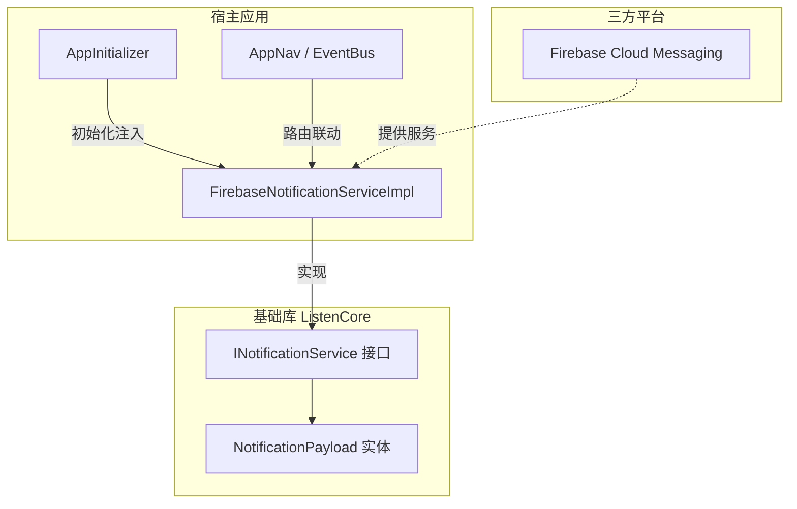
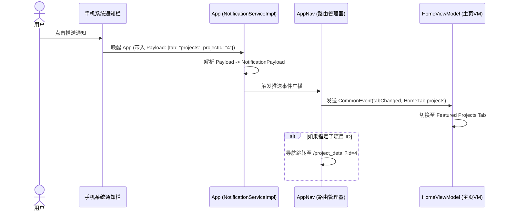

# 推送通知集成与抽象设计方案 (Push Notification Specification)

为了在作品集 App 中实现推送通知能力，同时保持基础库（`ListenCore`）与具体第三方推送平台（`Firebase Cloud Messaging`）的解耦，我们在此设计一套符合整洁架构原则的**推送通知抽象与集成方案**。

---

## 1. 设计目标与原则

* **平台无关性（Decoupling）**：基础库 `ListenCore` 不引入任何具体推送平台的依赖（如 Firebase、极光推送等），仅定义通信协议（接口与数据实体）。
* **生命周期感知**：能够支持 App 在**前台（Foreground）**、**后台（Background）**以及**已终止/未启动（Terminated）**三种状态下的消息接收和点击响应。
* **深度链接路由（Deep Linking）**：支持点击推送通知后自动解析 Payload 载荷，并通过 `AppNav` 与事件总线进行特定页面（如项目详情、CV页）的跳转。

---

## 2. 核心架构设计

我们采用**控制反转（IoC）**的思路，在 `ListenCore` 中提供接口定义与契约，在 `ListenPortfolioFlutter` 中使用 Firebase Cloud Messaging 进行具体实现。



---

## 3. 基础库接口定义 (`ListenCore`)

在 `ListenCore` 的 `lib/services/` 目录下（建议新建 `lib/services/notification_service.dart`）定义以下接口和数据模型：

### 3.1 数据实体定义

```dart
/// 推送通知载荷实体
class NotificationPayload {
  final String title;
  final String body;
  final Map<String, dynamic> data; // 自定义键值对参数

  const NotificationPayload({
    required this.title,
    required this.body,
    this.data = const {},
  });

  factory NotificationPayload.fromJson(Map<String, dynamic> json) {
    return NotificationPayload(
      title: json['title'] as String? ?? '',
      body: json['body'] as String? ?? '',
      data: json['data'] as Map<String, dynamic>? ?? const {},
    );
  }
}
```

### 3.2 抽象服务接口

```dart
import 'notification_payload.dart';

abstract class INotificationService {
  Future<void> initialize();
  Future<bool> requestPermission();
  Future<String?> getToken();
  Stream<String> get onTokenRefresh;
  Stream<NotificationPayload> get onMessageReceived;
  Stream<NotificationPayload> get onMessageOpenedApp;

  /// Subscribe to a notification topic
  Future<void> subscribeToTopic(String topic);

  /// Unsubscribe from a notification topic
  Future<void> unsubscribeFromTopic(String topic);
}
```

---

## 4. 宿主应用实现 (`ListenPortfolioFlutter`)

在宿主 App 中，我们使用 Firebase Cloud Messaging (FCM) 与本地通知插件 `flutter_local_notifications` 联合实现该接口。

### 4.1 核心服务实现类

创建 `lib/shared/services/firebase_notification_service_impl.dart`：

```dart
import 'dart:async';
import 'package:firebase_core/firebase_core.dart';
import 'package:firebase_messaging/firebase_messaging.dart';
import 'package:flutter_local_notifications/flutter_local_notifications.dart';
import 'package:listen_core/core.dart';
import 'package:listen_uikit/uikit.dart';

import '../../features/home/presentation/pages/home_state.dart';
import '../shared.dart';
import 'firebase_options.dart';

class FirebaseNotificationServiceImpl implements INotificationService {
  FirebaseMessaging get _fcm => FirebaseMessaging.instance;
  final FlutterLocalNotificationsPlugin _localNotifications = FlutterLocalNotificationsPlugin();

  final StreamController<NotificationPayload> _messageReceivedController =
      StreamController<NotificationPayload>.broadcast();
  final StreamController<NotificationPayload> _messageOpenedController =
      StreamController<NotificationPayload>.broadcast();

  bool _isFirebaseInitialized = false;

  @override
  Future<void> initialize() async {
    try {
      // 1. Initialize Firebase Core
      if (Firebase.apps.isEmpty) {
        await Firebase.initializeApp(
          options: DefaultFirebaseOptions.currentPlatform,
        );
      }
      _isFirebaseInitialized = true;
      appLogger.i('FirebaseNotificationService: Firebase initialized successfully.');
    } catch (e) {
      appLogger.w(
        'FirebaseNotificationService: Firebase initialization failed. '
        'Push notifications will fall back to mock/disabled mode. Error: $e',
      );
      _isFirebaseInitialized = false;
    }

    // Initialize Local Notifications regardless of Firebase state
    try {
      await _initLocalNotifications();
    } catch (e) {
      appLogger.w(
        'FirebaseNotificationService: Local notification initialization failed. Error: $e',
      );
    }

    if (!_isFirebaseInitialized) return;

    try {
      // 2. Configure Android high-importance channel
      const AndroidNotificationChannel channel = AndroidNotificationChannel(
        AppConstants.notificationChannelId,
        AppConstants.notificationChannelName,
        description: AppConstants.notificationChannelDescription,
        importance: Importance.high,
      );

      await _localNotifications
          .resolvePlatformSpecificImplementation<AndroidFlutterLocalNotificationsPlugin>()
          ?.createNotificationChannel(channel);

      // 3. Configure iOS foreground presentation settings
      await _fcm.setForegroundNotificationPresentationOptions(alert: true, badge: true, sound: true);

      // 4. Listen to foreground FCM messages
      FirebaseMessaging.onMessage.listen((RemoteMessage message) {
        // Discard if notifications are disabled in settings
        if (!SpUtil.getBool(AppConstants.notificationsKey, defaultValue: true)) return;

        _messageReceivedController.add(_convertMessage(message));

        // Show local banner for Android in foreground
        if (message.notification != null) {
          _showLocalNotification(message, channel);
        }
      });

      // 5. Listen to background click wakeup events
      FirebaseMessaging.onMessageOpenedApp.listen((RemoteMessage message) {
        // Discard if notifications are disabled in settings
        if (!SpUtil.getBool(AppConstants.notificationsKey, defaultValue: true)) return;

        final payload = _convertMessage(message);
        _messageOpenedController.add(payload);
        _handleNotificationNavigation(payload);
      });

      // 6. Handle terminated startup click
      final initialMessage = await _fcm.getInitialMessage();
      if (initialMessage != null) {
        // Discard if notifications are disabled in settings
        if (SpUtil.getBool(AppConstants.notificationsKey, defaultValue: true)) {
          final payload = _convertMessage(initialMessage);
          _messageOpenedController.add(payload);
          _handleNotificationNavigation(payload);
        }
      }

      // 7. Sync subscription to the version updates topic based on settings
      final isEnabled = SpUtil.getBool(AppConstants.notificationsKey, defaultValue: true);
      if (isEnabled) {
        await subscribeToTopic(AppConstants.versionUpdatesTopic);
      } else {
        await unsubscribeFromTopic(AppConstants.versionUpdatesTopic);
      }
    } catch (e) {
      appLogger.e('FirebaseNotificationService: Failed to setup FCM handlers: $e');
    }
  }

  /// Unified handler for notification click navigation routing.
  void _handleNotificationNavigation(NotificationPayload payload) {
    final data = payload.data;

    // Bring HomePage back to the front by popping sub-routes (e.g. SettingsPage)
    AppNavConfig.navigatorKey.currentState?.popUntil((route) {
      return route.settings.name == Routes.home || route.isFirst;
    });

    // Check for tab redirection
    if (data.containsKey(AppConstants.notificationParamTab)) {
      final tabStr = data[AppConstants.notificationParamTab] as String;
      if (tabStr == AppConstants.notificationTabSettings) {
        // Dispatch a sticky event to handle Settings page navigation via core deep link manager
        eventBus.fire(
          CommonEvent<Uri>(
            DeepLinkManager.deepLinkEventKey,
            data: Uri.parse('listen://settings?check_update=true'),
            sticky: true,
            autoClear: true,
          ),
        );
      } else {
        final targetTab = HomeTab.values.firstWhereOrNull((tab) => tab.name == tabStr);

        if (targetTab != null) {
          eventBus.fire(
            CommonEvent<Uri>(
              DeepLinkManager.deepLinkEventKey,
              data: Uri.parse('listen://home?tab=$tabStr'),
              sticky: true,
              autoClear: true,
            ),
          );
        }
      }
    }

    // Check for project deep link
    if (data.containsKey(AppConstants.notificationParamProjectId)) {
      final projectId = data[AppConstants.notificationParamProjectId] as String;
      eventBus.fire(
        CommonEvent<Uri>(
          DeepLinkManager.deepLinkEventKey,
          data: Uri.parse('listen://home?tab=projects'),
          sticky: true,
          autoClear: true,
        ),
      );
      CommonToast.show('Deep Link Triggered: Project ID $projectId');
    }
  }

  Future<void> _initLocalNotifications() async {
    const AndroidInitializationSettings androidSettings = AndroidInitializationSettings(
      AppConstants.defaultNotificationIcon,
    );
    const DarwinInitializationSettings iosSettings = DarwinInitializationSettings();

    await _localNotifications.initialize(
      settings: const InitializationSettings(android: androidSettings, iOS: iosSettings),
      onDidReceiveNotificationResponse: (NotificationResponse response) {
        final payloadData = response.payload;
        if (payloadData != null) {
          try {
            final decoded = jsonDecode(payloadData) as Map<String, dynamic>;
            final title = decoded['title'] as String? ?? '';
            final body = decoded['body'] as String? ?? '';
            final data = Map<String, String>.from((decoded['data'] as Map?) ?? {});
            final payload = NotificationPayload(title: title, body: body, data: data);

            _messageOpenedController.add(payload);
            _handleNotificationNavigation(payload);
          } catch (e) {
            appLogger.e('FirebaseNotificationService: Failed to parse local notification click payload: $e');
          }
        }
      },
    );
  }

  @override
  Future<bool> requestPermission() async {
    if (!_isFirebaseInitialized) return false;
    try {
      final settings = await _fcm.requestPermission(alert: true, badge: true, sound: true);
      return settings.authorizationStatus == AuthorizationStatus.authorized;
    } catch (e) {
      appLogger.w('FirebaseNotificationService: Failed to request push permission: $e');
      return false;
    }
  }

  @override
  Future<String?> getToken() async {
    if (!_isFirebaseInitialized) return null;
    try {
      return await _fcm.getToken();
    } catch (e) {
      appLogger.w('FirebaseNotificationService: Failed to get push token: $e');
      return null;
    }
  }

  @override
  Stream<String> get onTokenRefresh {
    if (!_isFirebaseInitialized) return const Stream.empty();
    return _fcm.onTokenRefresh;
  }

  @override
  Stream<NotificationPayload> get onMessageReceived => _messageReceivedController.stream;

  @override
  Stream<NotificationPayload> get onMessageOpenedApp => _messageOpenedController.stream;

  @override
  Future<void> subscribeToTopic(String topic) async {
    if (!_isFirebaseInitialized) return;
    try {
      await _fcm.subscribeToTopic(topic);
      appLogger.i('FirebaseNotificationService: Subscribed to topic "$topic".');
    } catch (e) {
      appLogger.e('FirebaseNotificationService: Failed to subscribe to topic "$topic": $e');
    }
  }

  @override
  Future<void> unsubscribeFromTopic(String topic) async {
    if (!_isFirebaseInitialized) return;
    try {
      await _fcm.unsubscribeFromTopic(topic);
      appLogger.i('FirebaseNotificationService: Unsubscribed from topic "$topic".');
    } catch (e) {
      appLogger.e('FirebaseNotificationService: Failed to unsubscribe from topic "$topic": $e');
    }
  }

  NotificationPayload _convertMessage(RemoteMessage message) {
    return NotificationPayload(
      title: message.notification?.title ?? '',
      body: message.notification?.body ?? '',
      data: message.data,
    );
  }

  void _showLocalNotification(RemoteMessage message, AndroidNotificationChannel channel) {
    final notification = message.notification;
    if (notification == null) return;

    _localNotifications.show(
      id: notification.hashCode,
      title: notification.title,
      body: notification.body,
      notificationDetails: NotificationDetails(
        android: AndroidNotificationDetails(
          channel.id,
          channel.name,
          channelDescription: channel.description,
          icon: AppConstants.defaultNotificationIcon,
        ),
      ),
      payload: jsonEncode({
        'title': notification.title ?? '',
        'body': notification.body ?? '',
        'data': message.data,
      }),
    );
  }
}
```


## 5. 深度链接与页面跳转流程 (Deep Linking Flow)

当用户点击通知栏的推送时，通知的 `payload.data` 包含路由跳转指示（如跳转到某一个 Feature 的 Tab 页或打开特定项目）：



### 5.1 宿主应用中的事件监听与路由跳转

在宿主 App 的全局入口（例如 `AppInitializer` 完成初始化后）订阅点击推送事件：

```dart
void setupNotificationNavigation(INotificationService notificationService) {
  notificationService.onMessageOpenedApp.listen((NotificationPayload payload) {
    final data = payload.data;
    
    // 1. 判断是否需要切换 Home 选项卡
    if (data.containsKey(AppConstants.notificationParamTab)) {
      final tabStr = data[AppConstants.notificationParamTab] as String;
      final targetTab = HomeTab.values.firstWhereOrNull((tab) => tab.name == tabStr);
      
      if (targetTab != null) {
        // 利用全局 EventBus 发送 Uri，由 HomeViewModel 进行拦截与更新
        eventBus.fire(
          CommonEvent<Uri>(
            DeepLinkManager.deepLinkEventKey,
            data: Uri.parse('listen://home?tab=$tabStr'),
            sticky: true,
            autoClear: true,
          ),
        );
      }
    }
    
    // 2. 判断是否包含特定的深度跳转（例如打开具体的项目详情）
    if (data.containsKey(AppConstants.notificationParamProjectId)) {
      final projectId = data[AppConstants.notificationParamProjectId] as String;
      AppNav.to(Routes.projectDetail, arguments: {Routes.argProjectId: projectId});
    }
  });
}
```

---

## 6. 环境接入与配置指南

### 6.1 Android 配置
1. 在 [Firebase Console](https://console.firebase.google.com/) 注册 Android 应用，下载 `google-services.json` 放入 `android/app/`。
2. 配置 SHA-1 指纹（由于涉及 Release 签名自动构建，需要在 Firebase 控制台同时关联 Debug keystore 和 Release keystore 的 SHA-1 证书）。
3. 动态配置 `AndroidManifest.xml` 中的通知图标与默认渠道属性。

### 6.2 iOS 配置
1. 在 Apple Developer 平台为 App ID 开启 **Push Notifications** 功能。
2. 配置并在 App Store Connect 中生成并上传 APNs 证书，或者使用 APNs 授权密钥 (p8) 关联至 Firebase Console。
3. 在 Xcode 的 Capabilities 中开启 **Push Notifications** 和 **Background Modes** (Remote notifications)。

### 6.3 Firebase CLI 自动初始化配置步骤 (FlutterFire)
为方便跨平台（Android、iOS、Web）统一自动管理 Firebase 配置文件和选项代码，推荐采用 FlutterFire CLI 自动化生成方案，具体步骤如下：
1. **控制台项目注册**：在 [Firebase Console](https://console.firebase.google.com/) 创建一个 Firebase 项目（仅需创建空项目，无需手动在后台注册应用或下载任何凭证）。
2. **本地安装 CLI 工具**：在开发机器上执行以下命令安装 Firebase 官方命令行工具：
   ```bash
   npm install -g firebase-tools
   ```
3. **命令行登录验证**：通过浏览器授权，登录您的 Google / Firebase 账号：
   ```bash
   firebase login
   ```
4. **激活 FlutterFire 辅助 CLI**：激活 Dart 环境下的官方 Flutter 扩展脚手架：
   ```bash
   dart pub global activate flutterfire_cli
   ```
   *注意：请确保您已将 Dart SDK 的全局 `pub` 二进制文件路径（如 Windows 的 `%APPDATA%\Pub\Cache\bin` 或 macOS/Linux 的 `$HOME/.pub-cache/bin`）添加到系统的 PATH 环境变量中，以便能够在任意路径直接调用 `flutterfire` 命令。*
5. **自动化配置项目**：在 Flutter 项目的根目录下执行：
   ```bash
   flutterfire configure
   ```
   *该命令会列出您账号下的所有 Firebase 项目。选择刚才创建的项目，并勾选您需要支持的平台（Android、iOS 等）。FlutterFire CLI 会自动连接 Firebase 控制台、在后台注册相应的 Android / iOS 应用，并全自动为您下载 `google-services.json` 和 `GoogleService-Info.plist` 配置文件放入正确的 Native 目录下，最后在 `lib/shared/services/`（或者您指定的路径）下自动生成统一的 `firebase_options.dart` 文件。*


---

## 7. 隐私与数据合规 (GDPR / Google Play 政策)

> [!IMPORTANT]
> 根据 Google Play 及 App Store 政策，推送通知属于用户敏感授权：
> 1. **首次打开禁强弹**：App 首次启动进入首页或登录页时，禁止在无引导的前提下强行弹出系统通知权限请求。本 App 的 `initialize()` 默认不发起任何权限申请弹窗。
> 2. **延迟与上下文式授权 (Scheme C)**：虽然本地设置中的推送开关默认开启，但当用户首次进入“设置页面” (`SettingsPage`) 时，系统才会主动检测并触发 `requestPermission()` 申请系统推送权限。若用户此时选择拒绝授权，App 会自动将推送开关校准更新为关闭状态，以保持 UI 显示与 OS 实际状态的完全一致，避免产生逻辑不一致的问题。
> 3. **隐私协议声明**：在下个版本的 `privacy_policy_page` 中，需明确增加一栏声明：说明本 App 使用 Firebase 服务在匿名（或用户授权绑定）前提下收集设备 Token 以用于传送个人作品集更新消息。

---

## 8. 推送测试与自动化部署脚本 (send_push_notification.js)

为了便于在本地或 CI/CD 流水线中进行消息推送测试，我们在 [tools/send_push_notification.js](../tools/send_push_notification.js) 中提供了一个便捷的 Node.js 脚本。

### 8.1 环境准备
在运行该脚本前，需具备以下条件：
1. **安装 Node.js**（支持 TLS/HTTPS 等模块）。
2. **下载 Firebase 服务账号密钥**：
   - 登录 [Firebase 控制台](https://console.firebase.google.com/) -> 选择项目 -> 项目设置 -> 服务账号。
   - 点击 **生成新的私钥**，下载 JSON 文件。
   - 将密钥内容配置到环境变量中，或保存在项目根目录下，命名为 `firebase-service-account.json`。
     - **环境变量**：`FIREBASE_SERVICE_ACCOUNT_KEY`（其值为服务账号 JSON 的完整字符串内容）。
     - **本地文件**：`firebase-service-account.json`（脚本会自动识别并读取）。

### 8.2 命令格式与选项
```bash
node tools/send_push_notification.js [options]
```

#### 可用选项：
- `--type <type>`：推送消息的类型。可选值为：
  - `update`：默认类型，表示新版本升级推送。
  - `tab`：跳转特定 Tab 页推送。
- `--tab <tab>`：目标 Tab 页名称。仅当 `--type` 为 `tab` 时生效，支持以下 Tab：
  - `overview`（概览）
  - `aboutMe`（关于我）
  - `projects`（项目列表）
  - `architecture`（架构）
  - `settings`（设置）
- `--token <token>`：特定设备的 FCM Token（单点目标投递）。
  - **提示**：如果省略该参数，推送会默认发往 `'version_updates'` 广播主题，使所有已安装并订阅该主题的设备都收到推送。建议在本地测试时指定 `--token` 以免干扰其他测试设备。
- `--title <title>`：自定义推送标题。默认优先采用英文标题。
- `--body <body>`：自定义推送正文。默认优先采用英文文案。
- `-h, --help`：打印脚本的使用帮助信息。

### 8.3 典型测试命令示例

1. **测试 A：向全局发送默认的新版本更新推送**
   ```bash
   node tools/send_push_notification.js
   ```

2. **测试 B：测试发送特定 Tab（例如项目 Tab）的切换通知**
   ```bash
   node tools/send_push_notification.js --type tab --tab projects --title "test title" --body "test body"
   ```

3. **测试 D：向您本人的开发设备发送单点推送（不干扰全局）**
   ```bash
   node tools/send_push_notification.js --type tab --tab settings --token "YOUR_FCM_REGISTRATION_TOKEN"
   ```
