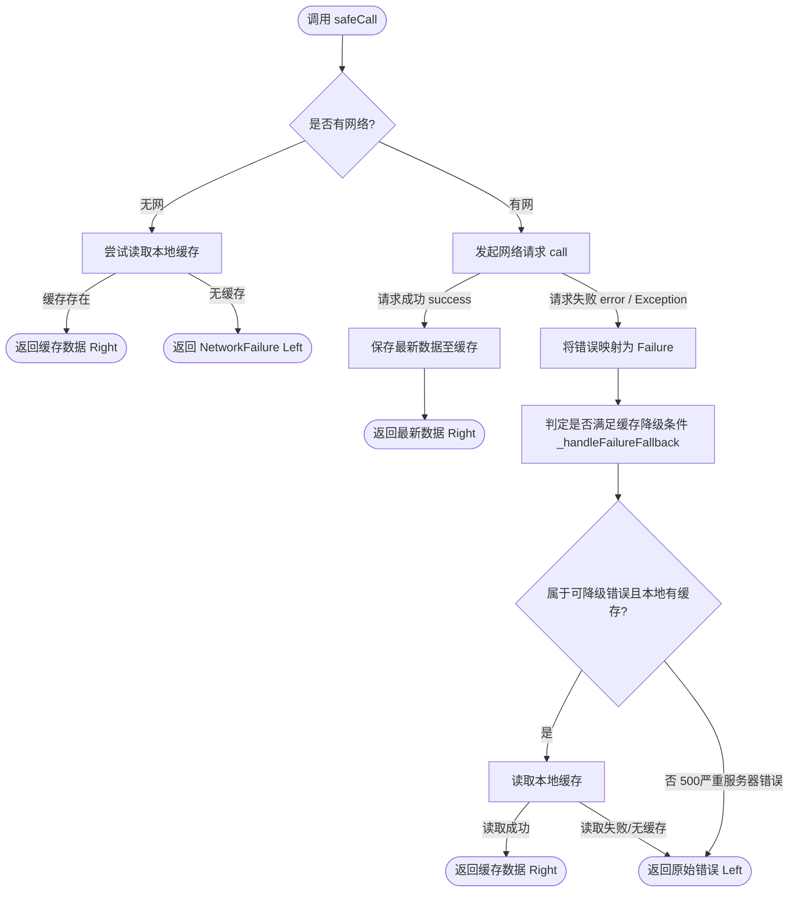

# BaseRepository 缓存与数据降级策略设计规范

为了保障 Listen 移动端应用在弱网、无网或服务端短时间抖动下的可用性，底座库 `ListenCore` 提供了一套统一的网络请求包装与二级缓存降级设计。该设计以 `BaseRepository` 的 `safeCall` 管道为核心，内置了网络状态审计、防数据脏写和错误分类降级机制。

本文档详细阐述其设计原理、生命周期流转及业务层的最佳实践。

---

## 1. safeCall 控制流图



---

## 2. safeCall 二级缓存控制逻辑

`safeCall` 内置了 4 个重要生命周期步骤，用于在不侵入业务的前提下处理容灾：

1. **无网拦截与离线秒开**：
   * 首先调用 `_networkInfo.isConnected` 评估当前设备的真实连通性。
   * 如果当前无网，且调用方传入了 `CacheDataSource` 缓存源，则立即就地读取缓存并以 `Right(cachedData)` 返回，从而实现离线秒开。
   * 若无本地缓存，则阻断后续 Dio 请求，直接返回 `Left(NetworkFailure)`。
2. **正常成功写入**：
   * 网络正常且接口响应 `ApiResult.success` 时，会自动将服务器响应的泛型数据 `T` 通过 `cacheDataSource.cache(data)` 或自定义的 `saveCache(data)` 回调写入本地存储，保证缓存为最新的干净状态。
3. **Dio 拦截与异常映射**：
   * 接口报错或超时会被统一捕获，并映射为对应的领域 Failure 变体（如 `AuthFailure`、`ServerApiFailure`、`ServerFailure`），交给降级过滤器处理。
4. **分类降级处理器 (`_handleFailureFallback`)**：
   * 决定是否用历史缓存“掩盖”当前发生的网络/系统错误。其核心判断规则如下：
     * **允许降级的异常**：网络超时（Timeout）、临时断网等。
     * **默认拦截（不执行降级）的异常**：服务器 500 严重系统错误（`ServerFailure`）、数据解析异常（`ParseFailure`）。

---

## 3. 防脏数据与防错误遮蔽设计

在移动端容灾中，“使用旧缓存”是一把双刃剑：如果使用不当，会导致客户端在服务器逻辑崩溃、账户越权、或接口改版报错时，依旧给用户展示老旧的假数据，造成严重线上事故。因此，`BaseRepository` 设计了以下防脏防护网：

### 3.1 为什么服务器 500 默认不使用缓存降级？
如果服务器发生致命的逻辑崩溃（如 500 错误），通常代表业务状态发生了严重异常。默认不降级缓存，能保证真实的报错被抛给 View 层和可观测性组件（APM），防止后台已经报错但客户端仍然假装正常运行的假象。
* **自定义越权覆盖**：如果某个静态数据页面（例如：关于我、过往作品）在 500 时仍希望继续展示本地缓存，可以通过传递 `useCacheCondition` 重写默认过滤行为：
  ```dart
  final result = await safeCall(
    call: () => remoteDataSource.fetchAboutMe(),
    cacheDataSource: localCacheSource,
    useCacheCondition: (failure) => true, // 强制任何 Failure 变体都进行缓存降级
  );
  ```

### 3.2 为什么数据解析异常 (TypeError) 绝不降级？
如果因为服务器下发字段改版，在客户端引发了 `TypeError`，此时会直接返回 `Left(ParseFailure)` 阻断后续流程。
* **原因**：这说明客户端的模型与服务器当前的契约发生了版本偏差。如果此时还使用老缓存，可能导致局部 UI 崩坏甚至 Crash。不降级缓存能促使该异常在测试期被立刻暴露，并被 Trace 日志精准捕获。

---

## 4. 实践指南：实现带生存时限 (TTL) 的缓存

底座中定义的 `CacheDataSource<T>` 是最简化的接口，在业务层，我们可以通过扩展数据结构轻松为其添加 TTL（生存时间）限制：

### 4.1 定义带时间戳的缓存包装实体
```dart
import 'package:freezed_annotation/freezed_annotation.dart';

part 'cached_item.freezed.dart';
part 'cached_item.g.dart';

@Freezed(genericArgumentFactories: true)
class CachedItem<T> with _$CachedItem<T> {
  const factory CachedItem({
    required T data,
    required int timestamp, // 缓存写入时的时间戳 (毫秒)
  }) = _CachedItem<T>;

  const CachedItem._();

  /// 判断该缓存项是否已过期
  bool isExpired(Duration ttl) {
    final now = DateTime.now().millisecondsSinceEpoch;
    return (now - timestamp) > ttl.inMilliseconds;
  }

  factory CachedItem.fromJson(Map<String, dynamic> json, T Function(Object?) fromJsonT) =>
      _$CachedItemFromJson(json, fromJsonT);
}
```

### 4.2 实现具备 TTL 的 CacheDataSource
```dart
class ProjectsLocalDataSource implements CacheDataSource<List<ProjectModel>> {
  final Duration _ttl = const Duration(hours: 2); // 缓存有效期 2 小时

  @override
  Future<void> cache(List<ProjectModel> data) async {
    final wrapper = CachedItem(
      data: data,
      timestamp: DateTime.now().millisecondsSinceEpoch,
    );
    final jsonStr = jsonEncode(wrapper.toJson((list) => list.map((e) => e.toJson()).toList()));
    await SpUtil.put('projects_cache_key', jsonStr);
  }

  @override
  Future<List<ProjectModel>?> getCached() async {
    final jsonStr = SpUtil.get<String>('projects_cache_key');
    if (jsonStr == null || jsonStr.isEmpty) return null;

    try {
      final jsonMap = jsonDecode(jsonStr) as Map<String, dynamic>;
      final wrapper = CachedItem<List<ProjectModel>>.fromJson(
        jsonMap,
        (obj) => (obj as List).map((e) => ProjectModel.fromJson(e as Map<String, dynamic>)).toList(),
      );

      if (wrapper.isExpired(_ttl)) {
        appLogger.d('Projects cache expired. Discarding.');
        return null; // 缓存过期，丢弃以触发重新拉取
      }
      return wrapper.data;
    } catch (e) {
      return null;
    }
  }
}
```

---

## 5. 实践指南：Stale-While-Revalidate (SWR) 模式

对于首屏或核心列表页（如 OverviewWidget），最佳的用户体验是**进入即秒开**，随后在**后台异步发起网络请求**静默刷新。

我们可以使用 SWR 模式在 `BaseViewModel` 优雅实现该机制：

```dart
class OverviewViewModel extends BaseViewModel<OverviewIntent, OverviewState, OverviewEffect> {
  final OverviewRepository repository;

  Future<void> loadOverviewData() async {
    // 1. Stale: 优先从本地缓存提取历史数据，若存在则立即刷新 UI 展现秒开效果
    final cachedData = await repository.getLocalOverview();
    if (cachedData != null) {
      updateState(state.copyWith(data: cachedData));
    } else {
      // 若完全没有缓存，则可以 emitEffect(LoadingEffect(true)) 展示骨架屏
      emitEffect(LoadingEffect(true));
    }

    // 2. Revalidate: 后台发起异步请求，安全调用网络接口
    final result = await repository.fetchOverview();
    
    result.fold(
      (failure) {
        // 如果网络请求失败且此前已展示了旧缓存，则可以仅以轻 Toast 告知弱网，无需全屏红牌阻断
        if (state.data != null) {
          emitEffect(MessageEffect.info(I18nKeys.weakNetworkWarning.tr));
        } else {
          handleFailure(failure); // 彻底没有缓存数据可用时，走兜底错误页
        }
      },
      (freshData) {
        // 请求成功：将最新数据刷入 State 刷新 UI（同时 safeCall 会静默更新本地持久化缓存）
        updateState(state.copyWith(data: freshData));
      },
    );

    emitEffect(LoadingEffect(false));
  }
}
```

---

## 6. 缓存 Key 命名约定

为了防止本地持久化（如 `SharedPreferences` / `SecureStorage`）中发生键值冲突，并便于未来的 `DiskCleanupUtil` 做细粒度的存储审计，所有本地缓存 Key 必须遵循以下命名规约：

```
[Domain]_[SubDomain]_[DynamicParameters]
```

* **示例**：
  * 全局会话：`auth_session`
  * 用户简历：`profile_resume_data`
  * 项目详情：`projects_detail_{projectId}`

---

## 7. 技术难点与解决方案 (Technical Challenges & Solutions)

### 7.1 并发请求的缓存读写踩踏 (Race Conditions)
* **难点**：在弱网下，当多个组件同时触发针对同一个资源的拉取请求时，可能会导致并发写入相同的缓存 Key，甚至发生新数据被旧数据复写的时序问题。
* **解决方案**：业务层配合 `ListenCore` 时应利用防抖 (Debounce) 或请求队列机制，并且缓存 DataSource 中的 `cache()` 方法在内部使用异步锁或基于本地文件的原子写入。

### 7.2 动态响应体结构与缓存契约失效
* **难点**：服务端下发的数据结构发生变化（增删字段）后，由于本地还存在老结构的 JSON，反序列化时将直接触发 `ParseFailure`。
* **解决方案**：正如前文防脏数据所述，`safeCall` 遇到此类解析异常强制阻断，同时开发时配合 `json_serializable` 的 `unknownEnumValue` 和兼容解析策略，避免硬性 Crash。

## 8. 设计亮点 (Implementation Highlights)

1. **侵入极小的声明式缓存**：通过向 `safeCall` 管道注入 `CacheDataSource` 对象，核心数据获取和缓存回退逻辑被完全封装在底座中。上层 ViewModel 和 Widget 层完全感知不到它是网络最新数据还是缓存数据，极大简化了业务代码。
2. **SWR 模式无缝衔接**：这套缓存机制天然支持 Stale-While-Revalidate（缓存更新模式），配合 MVI 的 `updateState` 可以瞬间展示旧数据、再平滑过渡到新数据，有效填补了白屏期。

## 9. 设计思路 (Design Rationale)

* **离线优先 (Offline-First) 与安全防御**：移动端应用的网络环境充满了不确定性。将“缓存降级”拔高到框架层面，能够强制开发人员对每一个重要的数据接口进行离线思考。不仅是为了优化首屏启动时间，更是应对服务器短暂无响应、网络劫持等极端灾难时的最后一道防线。不盲目缓存 500 和解析异常，展现了“宁可报错不可错乱”的安全设计哲学。
