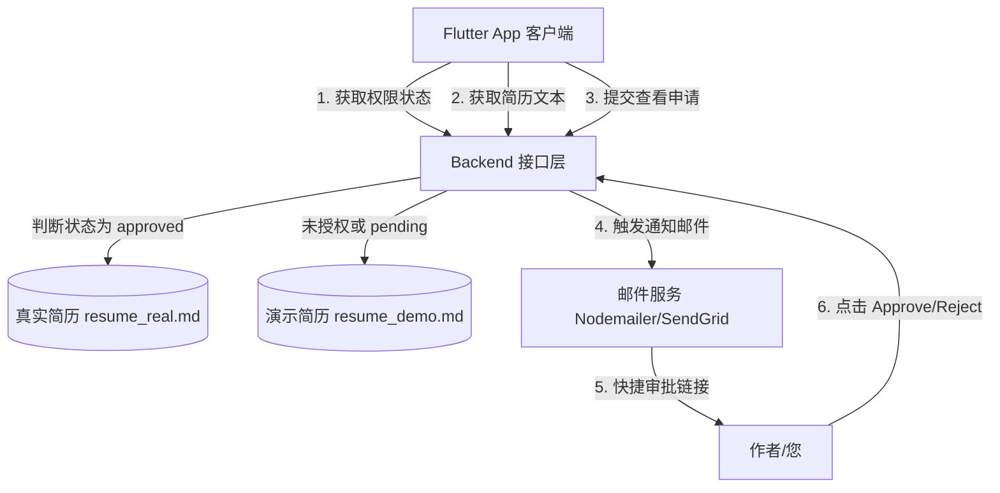
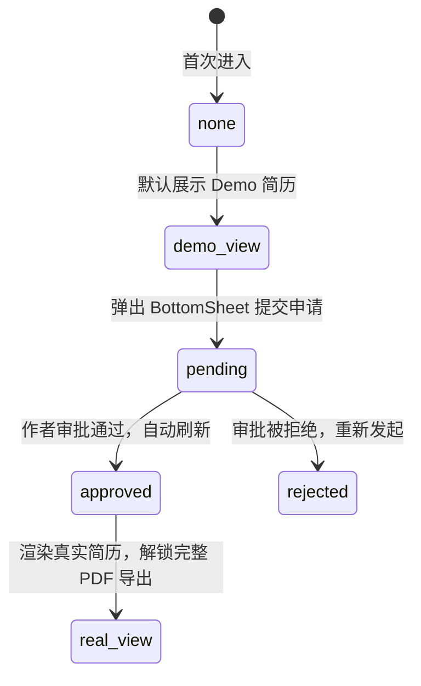

# 安全简历授权与渲染系统 - 详细设计与实现方案

本项目旨在建立一套安全的、端到端的个人简历管理系统。通过将简历托管方式从“公开的 GitHub 静态路径”重构为“基于服务端 JWT 验证与动态审批流的管理系统”，实现保护个人电话、邮箱、具体就职项目等隐私数据的安全，同时为来访 HR/技术负责人提供无缝的高端申请体验。

---

## 1. 系统总体架构

整个授权机制由前端 Flutter App 与 Node.js 后端服务（Portfolio Backend）协作完成。



### 简历内容隔离策略
* **演示版简历 (`resume_demo.md`)**：
    * 去除或打码关键联系信息（如 `138****8888`，`l***@example.com`）。
    * 关键公司敏感代号模糊处理（如：国内某头部大厂、某海外科技公司）。
    * 存储在服务器非公开目录中，作为未授权时的默认响应。
* **真实版简历 (`resume_real.md`)**：
    * 包含完整的联系电话、邮箱、项目名称及详细架构描述。
    * 存储在服务器的安全隔离目录中，只允许在校验到用户获得授权后才通过流方式回传给客户端。

---

## 2. 后端数据模型与 API 设计

在 `ListenPortfolioBackend` 服务端中，需要新增申请单管理并实现动态权限验证。

### 2.1 数据库结构：`resume_requests`

用于记录每个来访注册用户的简历申请状态。

| 字段名 (Field) | 类型 (Type) | 说明 (Description) |
|---|---|---|
| `id` | String | 主键 UUID |
| `user_id` | String | 申请者的用户 ID (关联 User 表外键) |
| `company` | String | 申请人就职公司名称 |
| `title` | String | 申请人职位 |
| `email` | String | 接收通知的电子邮箱 |
| `purpose` | String | 申请访问目的 (技术交流/面试邀请/猎头推荐等) |
| `status` | Enum | 审批状态：`pending` (审批中), `approved` (已授权), `rejected` (已拒绝) |
| `created_at` | DateTime | 申请时间 |
| `updated_at` | DateTime | 审批处理时间 |

---

### 2.2 API 路由定义

所有请求均需在 Header 中携带 JWT Token 以识别当前访问的 `user_id`。

#### A. 查询简历授权状态
* **路径**：`GET /v1/resume/status`
* **鉴权**：Bearer JWT Token
* **返回**：
  ```json
  {
    "code": 200,
    "data": {
      "status": "none | pending | approved | rejected"
    }
  }
  ```

#### B. 提交查看申请
* **路径**：`POST /v1/resume/request`
* **鉴权**：Bearer JWT Token
* **Body 参数**：
  ```json
  {
    "company": "Google",
    "title": "Senior Staff Recruiter",
    "email": "hr@google.com",
    "purpose": "面试邀请 - 移动端架构师"
  }
  ```
* **返回**：
  ```json
  {
    "code": 200,
    "message": "Application submitted successfully"
  }
  ```
* **后端副作用**：保存到 `resume_requests` 表，并利用 `nodemailer` 给作者（您）发送一封邮件，邮件内容中嵌入一键通过/拒绝的短链接（例如带有哈希签名保护的 API 请求 URL）。

#### C. 拉取简历文本内容 (核心防护口)
* **路径**：`GET /v1/resume/content`
* **鉴权**：Bearer JWT Token
* **接口逻辑**：
  ```javascript
  // 1. 从 Token 解析 userId
  const userId = req.user.id;
  
  // 2. 在数据库查找该用户的审批记录
  const request = await db.resume_requests.findOne({ user_id: userId });
  
  // 3. 根据审批状态返回对应的物理文件内容
  if (request && request.status === 'approved') {
    const realResume = await fs.readFile('./secured/resume_real.md', 'utf8');
    return res.json({ code: 200, data: realResume });
  } else {
    const demoResume = await fs.readFile('./secured/resume_demo.md', 'utf8');
    return res.json({ code: 200, data: demoResume });
  }
  ```

---

## 3. Flutter App 客户端适配 (符合 MVI 规范)

客户端应根据服务端的授权状态，动态渲染横幅、弹窗及内容。

### 3.1 状态模型扩展

修改 `ResumeState`，追加权限状态字段：

```dart
@freezed
abstract class ResumeState extends BaseState with _$ResumeState {
  const factory ResumeState({
    @Default(false) bool isLoading,
    @Default('') String markdownContent,
    @Default(false) bool isExporting,
    @Default('none') String accessStatus, // none, pending, approved, rejected
    String? errorMessage,
  }) = _ResumeState;

  const ResumeState._();
}
```

---

### 3.2 交互意图扩展

修改 `ResumeIntent`，加入获取状态与提交请求的意图：

```dart
@freezed
class ResumeIntent extends BaseIntent with _$ResumeIntent {
  const factory ResumeIntent.init() = _Init;
  const factory ResumeIntent.checkAccessStatus() = _CheckAccessStatus;
  const factory ResumeIntent.submitRequest({
    required String company,
    required String title,
    required String email,
    required String purpose,
  }) = _SubmitRequest;
  const factory ResumeIntent.exportPDF() = _ExportPDF;
  const ResumeIntent._();
}
```

---

### 3.3 UI 状态机与展现

在 `ResumePage` 中，根据状态动态显示不同的状态横幅（Banner）：



#### 横幅 UI 视觉设计 (Glassmorphic Banner)
* **未授权状态 (`none`)**：
  在简历视图的最上方，提供一块毛玻璃背景的常驻提醒卡片，背景色带有高对比强调色渐变效果：
  > 💡 **当前为 Demo 演示版**
  > 联系方式与部分关键履历信息已脱敏隐藏。若要获取完整版履历或下载真实简历 PDF，您可以
  > [👉 点击申请解锁完整简历] (触发模态框弹窗)。
* **申请审核中 (`pending`)**：
  提醒卡片变成柔和的沙漏黄底色，按钮变为不可点击的灰色：
  > ⏳ **授权请求审核中...**
  > 我们已向作者推送了您的解锁申请。结果将通过邮件通知您，敬请耐心等待。
* **已授权状态 (`approved`)**：
  横幅自动消失，直接渲染并展示 `resume_real.md` 的内容，PDF 按钮也切换为导出真实简历。

---

## 4. 极致安全性考量 (Security Analysis)

1. **防止直接抓包泄露**：
   网络请求均需在 Header 中传递带有有效期的 JWT Token。未授权用户无法通过直接修改 URL 或是对网络进行 Replay 攻击来获取 `resume_real.md`。
2. **防暴力破解与爬虫**：
   后端对 `GET /v1/resume/content` 实施基于 IP 和用户 ID 的 Rate Limiting (限流) 机制（例如每小时最多请求 20 次），从底层掐断自动爬虫。
3. **安全的一键授权邮件**：
   发送给作者的审批邮件中的 `Approve` 链接需带有临时生成的、且具有时效性的签名哈希（Signature Hash），防止审批链接在传输链路中被旁路窃听拦截导致非授权批准。
