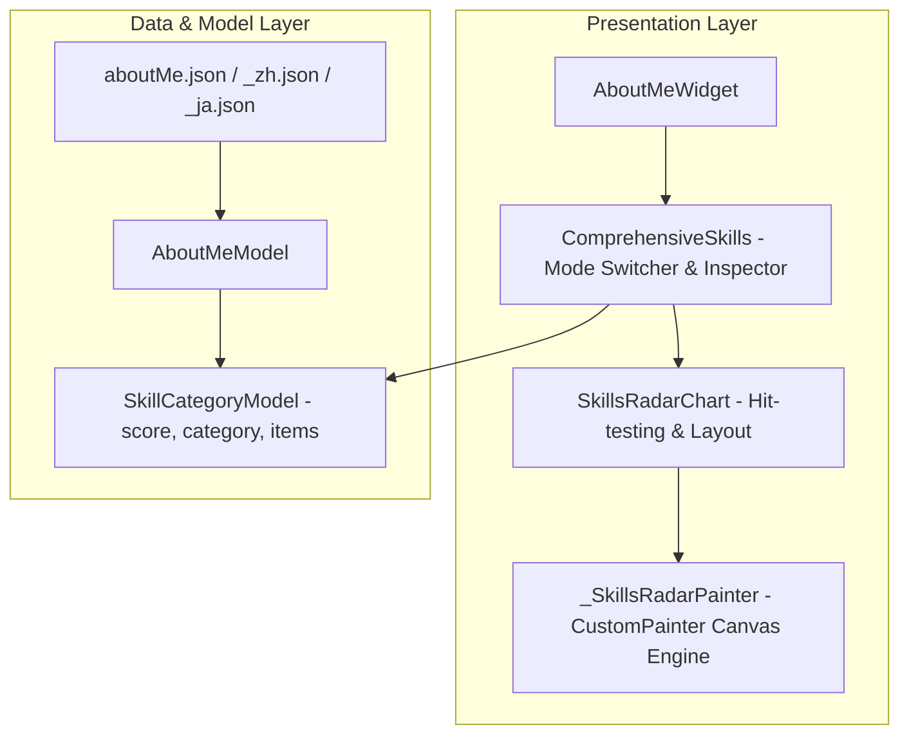

# Skills 技能雷达图 (Skills Radar Chart) - 设计与实现文档

**Status**: `Implemented & Verified (100% Green Test Suite - 534 Tests Passed)`

---

## 1. 背景与设计目标

在个人技术作品集与招聘面试场景中，如何向面试官直观展示候选人的**多维度技能深度与全栈架构广度**，是决定第一印象的关键。

为了替代传统单一静态的纯文本标签堆叠，我们在 [AboutMeWidget](file:///c:/Users/liste/Downloads/github/ListenPortfolioFlutter/lib/features/home/presentation/pages/about_me/about_me_widget.dart) 模块中设计并实现了基于 Flutter 底层绘图引擎 (`CustomPainter`) 的 **交互式技能雷达图 (Skills Radar Chart)**。

### 核心设计目标：
1. **多维度能力模型 (6 Dimensions Capability Matrix)**：涵盖 6 大核心支柱（移动端开发、系统架构设计、性能调优与 APM、稳定性与容灾防御、后端与云原生、工程化与 DevOps），综合得分 85~96 分。
2. **纯原生 Canvas 自定义绘制 (CustomPainter)**：使用底层 `Canvas` API 绘制多层正六边形同心网格骨架、发散轴线、动态渐变填充多边形（`LinearGradient` 着色器）与顶点数据光圈。
3. **入场动效与平滑插值 (CurvedAnimation)**：集成 `AnimationController`，在视图展现时从中心 $(0,0)$ 呈 `Curves.easeOutCubic` 缓动展开，带来流畅高级的交互质感。
4. **探针交互与下钻联动 (Touch Hit-Testing & Inspector Card)**：
   * 支持雷达顶点触摸检测（通过 $\text{atan2}$ 极坐标角度映射判定最近顶点）；
   * 点击或滑动顶点时触发高亮脉冲光圈，并动态刷新下方**技能详情卡片**（展示该维度的专业评分进度条与核心技能标签）。
5. **双视图模式平滑切换 (Radar vs List Mode)**：支持在「📊 雷达图」与「🏷️ 清单列表」双视图之间通过 `AnimatedSwitcher` 秒级切换。
6. **全动态主题与多语言规范 (Zero Raw Color & Zero Hardcoded String)**：100% 遵循 `context.colorScheme` / `context.theme`，所有文本收口至 `I18nKeys` 并配置中、英、日三语翻译。

---

## 2. 架构设计与组件分层

---

## 3. 数学建模与 Canvas 绘制算法

### 3.1 极坐标正多边形顶点计算
设有 $N$ 个技能维度（当前 $N=6$），多边形外接圆半径为 $R$。为保证首个顶点位于正上方（12 点钟方向），每个维度的起始方位角定义为：
$$\theta_i = -\frac{\pi}{2} + \frac{2\pi \cdot i}{N}, \quad i \in [0, N-1]$$

### 3.2 动画插值与数据多边形顶点
设第 $i$ 个维度的评分归一化值为 $S_i = \frac{\text{score}_i}{100} \in [0.0, 1.0]$，动画当前进度为 $t = \text{animation.value} \in [0.0, 1.0]$：
$$P_i(t) = \left( c_x + R \cdot S_i \cdot t \cdot \cos\theta_i, \; c_y + R \cdot S_i \cdot t \cdot \sin\theta_i \right)$$

### 3.3 触摸手势碰撞检测 (Touch Hit-Testing)
用户在 Canvas 上的点击坐标为 $(x, y)$，相对于中心点 $(c_x, c_y)$ 的偏移量为 $(\Delta x, \Delta y)$：
1. 计算极径 $d = \sqrt{\Delta x^2 + \Delta y^2}$，若 $d < 10\text{px}$ 则忽略误触；
2. 计算极角 $\phi = \text{atan2}(\Delta y, \Delta x) + \frac{\pi}{2}$（转为以正上方为 0 点并归一化到 $[0, 2\pi)$）；
3. 映射到最近维度索引：
   $$\text{index} = \left\lfloor \frac{\phi}{\Delta\theta} + 0.5 \right\rfloor \pmod N$$

---

## 4. 关键交付文件清单

| 文件路径 | 职责 |
|---|---|
| [skills_radar_chart.dart](file:///c:/Users/liste/Downloads/github/ListenPortfolioFlutter/lib/features/home/presentation/pages/about_me/widgets/skills_radar_chart.dart) | 底层 `CustomPainter` 雷达图绘制与触摸手势拾取组件 |
| [comprehensive_skills.dart](file:///c:/Users/liste/Downloads/github/ListenPortfolioFlutter/lib/features/home/presentation/pages/about_me/widgets/comprehensive_skills.dart) | 技能模块总装组件（视图切换、动画驱动、维度选择器与详情检查卡） |
| [about_me_model.dart](file:///c:/Users/liste/Downloads/github/ListenPortfolioFlutter/lib/features/home/data/models/about_me_model.dart) | `SkillCategoryModel` 扩充 `score` 评分字段并生成 Freezed 模型 |
| [translations_key.dart](file:///c:/Users/liste/Downloads/github/ListenPortfolioFlutter/lib/shared/i18n/translations_key.dart) | 新增 `skillRadar`、`skillScore`、`viewModeRadar` 等多语言 Key 定义 |
| [zh.dart](file:///c:/Users/liste/Downloads/github/ListenPortfolioFlutter/lib/shared/i18n/languages/zh.dart) / [ja.dart](file:///c:/Users/liste/Downloads/github/ListenPortfolioFlutter/lib/shared/i18n/languages/ja.dart) | 中、英、日三语翻译字典映射 |
| [aboutMe.json](file:///c:/Users/liste/Downloads/github/ListenPortfolioFlutter/assets/mock/v1/get/aboutMe.json) / `_zh.json` / `_ja.json` | 6 大维度技能数据与 0~100 评分映射 |
| [skills_radar_widget_test.dart](file:///c:/Users/liste/Downloads/github/ListenPortfolioFlutter/test/features/home/about_me/skills_radar_widget_test.dart) | 雷达图渲染、手势交互、视图切换、空数据防护全量 Widget 测试 |

---

## 5. 质量与测试验证

- **单元与 Widget 测试**：新增 `skills_radar_widget_test.dart`（覆盖空状态、雷达模式默认渲染、维度点击切换、雷达与列表双向切换、Canvas 手势命中测试）。
- **全量测试套件**：全工程 **534 项** 单元与集成测试用例 **100% 绿灯通过**。
- **静态分析与依赖规则**：
  - `flutter analyze` 保持 `No issues found!` 零警告；
  - `dart tools/dependency_rules.dart` 架构单向依赖零违规。
